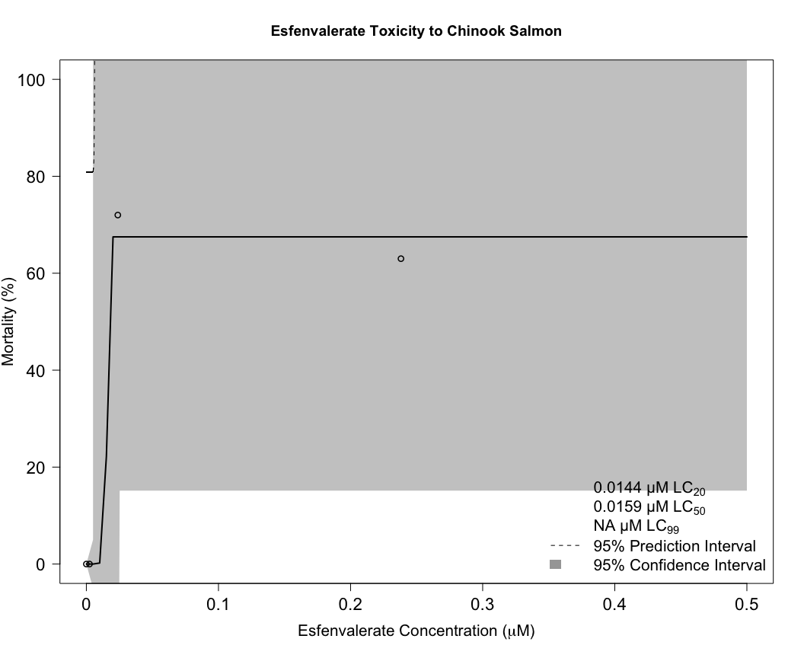

# Introduction
This documented is code for creating dose response curves for the 


```r
library(drc) # Required for making and analyzing concentration-response curves
library(tidyverse) 
library(ggplot2)
```

# Load Data

```{.r .fold-show}
chinook <- read.csv("chinooktoxdataM.csv")
bass <- read.csv("basstoxdataM.csv")
```

# Striped Bass

### Copper {.tabset .tabset-pills .tabset-fade}

#### Constructing Model 


```r
bassCu_drm = drm(percentmortality~conc, data = bass[1:76, 1:2], fct = EXD.3())
x1 = seq(0,100, by = 0.1)
new1 = data.frame(dose = x1)
bassCu_pred_ints = predict(bassCu_drm, interval = "prediction", 
                                     newdata = new1) #calculates 95% prediction intervals for curve

# Selecting model: best is EXD.3
mselect(bassCu_drm, list(LL.5(), LL.4(), LL.3(), LL.2(), LN.2(), LN.4(), LN.3(),
                               W1.3(), W1.4(), W2.3(), W2.4(), EXD.2(), EXD.3())) # Selecting model: to find details on these models, look at the DRC pdf
```

```
## Error in optim(startVec, opfct, hessian = TRUE, method = optMethod, control = list(maxit = maxIt,  : 
##   non-finite finite-difference value [2]
## Error in optim(startVec, opfct, hessian = TRUE, method = optMethod, control = list(maxit = maxIt,  : 
##   non-finite finite-difference value [2]
```

```
##          logLik       IC  Lack of fit  Res var
## EXD.3 -373.0680 754.1360 5.596802e-11 1118.759
## EXD.3 -373.0680 754.1360 5.596802e-11 1118.759
## W2.3  -373.6748 755.3496 3.461847e-11 1136.767
## LN.3  -373.7244 755.4488 3.328347e-11 1138.253
## W1.3  -373.7318 755.4637 3.308831e-11 1138.475
## LL.3  -373.7670 755.5339 3.217983e-11 1139.528
## W2.4  -373.6538 757.3076 1.416720e-11 1151.919
## LN.4  -373.7161 757.4322 1.347862e-11 1153.810
## W1.4  -373.7168 757.4336 1.347139e-11 1153.830
## LL.4  -373.7444 757.4889 1.317664e-11 1154.671
## LL.5  -373.6255 759.2511 5.471349e-12 1167.275
## EXD.2 -389.3253 784.6506 3.006902e-16 1692.891
## LL.2         NA       NA           NA       NA
## LN.2         NA       NA           NA       NA
```

#### Plot Model 

```r
plot(bassCu_drm, log = '', xlab = expression(paste("Copper Concentration (",mu,"M)")), 
     ylab = "Mortality (%)",
     type = "confidence", #adds 95% confidence intervals to plot
     main = "Copper Toxicity to Striped Bass",
     lwd = 2, cex.lab = 1.3, cex.axis = 1.4, xlim = c(0,100), ylim = c(0,100))

points(percentmortality~conc, data = bass[1:76, 1:2], pch = 1, lwd = 1.5) #plot data 
lines(bassCu_pred_ints[,2]~x1, lty = 2) #plot lower prediction bounds
lines(bassCu_pred_ints[,3]~x1, lty = 2) #plot upper prediction bounds

legend("bottomright", c(expression("0.143 μM LC"[20]), expression("0.445 μM LC"[50]), expression("2.96 μM LC"[99]),
                        "95% Prediction Interval", "95% Confidence Interval"), #change after running ED code below
       lty = c(NA, NA, NA, 2, NA), fill = c(NA, NA, NA, NA,"gray65"), border = "white", bty = 'n', 
       merge = TRUE, cex = 1.3)
```

<!-- -->

```r
ED(bassCu_drm, c(20,50,99), interval = "delta")
```

```
## 
## Estimated effective doses
## 
##        Estimate Std. Error    Lower    Upper
## e:1:20 0.136088   0.046523 0.043368 0.228809
## e:1:50 0.422729   0.144514 0.134714 0.710745
## e:1:99 2.808553   0.960128 0.895021 4.722085
```

### Cadmium {.tabset .tabset-pills .tabset-fade}

#### Constructing Model 

```r
bassCd_drm = drm(percentmortality~conc, data = bass[77:232, 1:2], fct = W2.4())
x2 = seq(0,250, by = 1)
new2 = data.frame(dose = x2)
bassCd_pred_ints = predict(bassCd_drm, interval = "prediction", newdata = new2)

# Selecting model: best is W2.4
mselect(bassCd_drm, list(LL.5(), LL.4(), LL.3(), LL.2(), LN.2(), LN.4(), LN.3(),
                               W1.3(), W1.4(), W2.3(), W2.4(), EXD.2(), EXD.3())) # Selecting model: to find details on these models, look at the DRC pdf
```

```
## Error in optim(startVec, opfct, hessian = TRUE, method = optMethod, control = list(maxit = maxIt,  : 
##   non-finite finite-difference value [2]
## Error in optim(startVec, opfct, hessian = TRUE, method = optMethod, control = list(maxit = maxIt,  : 
##   non-finite finite-difference value [2]
```

```
##          logLik       IC  Lack of fit   Res var
## W2.4  -720.3544 1450.709 2.019829e-05  616.1015
## W2.4  -720.3544 1450.709 2.019829e-05  616.1015
## LL.5  -719.6837 1451.367 1.781722e-05  614.8711
## LN.4  -721.1037 1452.207 1.218225e-05  622.0484
## LL.4  -721.2423 1452.485 1.108929e-05  623.1546
## W2.3  -722.2630 1452.526 9.866850e-06  627.2361
## W1.4  -721.8969 1453.794 7.099055e-06  628.4066
## LN.3  -723.7832 1455.566 3.514440e-06  639.5807
## LL.3  -724.0993 1456.199 2.829619e-06  642.1779
## W1.3  -725.7378 1459.476 9.102851e-07  655.8104
## EXD.3 -729.1277 1466.255 8.275432e-08  684.9403
## EXD.2 -796.6744 1599.349 8.217144e-31 1617.7655
## LL.2         NA       NA           NA        NA
## LN.2         NA       NA           NA        NA
```

#### Plotting Model 

```r
plot(bassCd_drm, log = '', xlab = expression(paste("Cadmium Concentration (",mu,"M)")), 
     ylab = "Mortality (%)",
     type = "confidence", #adds 95% confidence intervals to plot
     main = "Cadmium Toxicity to Striped Bass",
     lwd = 2, cex.lab = 1.3, cex.axis = 1.4, xlim = c(0,250), ylim = c(0,100))

points(percentmortality~conc, data = bass[77:232, 1:2], pch = 1, lwd = 1.5) #plot data 
lines(bassCd_pred_ints[,2]~x2, lty = 2) #plot lower prediction bounds
lines(bassCd_pred_ints[,3]~x2, lty = 2) #plot upper prediction bounds

legend("right", c(expression("0.0193 μM LC"[20]), expression("0.0598 μM LC"[50]), expression("0.398 μM LC"[99]),
                        "95% Prediction Interval", "95% Confidence Interval"), #change after running ED code below
       lty = c(NA, NA, NA, 2, NA), fill = c(NA, NA, NA, NA,"gray65"), border = "white", bty = 'n', 
       merge = TRUE, cex = 1.3)
```

<!-- -->

```r
ED(bassCd_drm, c(20,50,99), interval = "delta")
```

```
## 
## Estimated effective doses
## 
##         Estimate Std. Error     Lower     Upper
## e:1:20 0.0550448  0.0101897 0.0349131 0.0751764
## e:1:50 0.0816354  0.0081452 0.0655429 0.0977279
## e:1:99 0.1577073  0.0262059 0.1059325 0.2094821
```

### Molinate {.tabset .tabset-pills .tabset-fade}

#### Constructing Model 

```r
bassMol_drm = drm(percentmortality~conc, data = bass[233:280,1:2], fct = EXD.3())
x3 = seq(0,225, by = 0.1)
new3 = data.frame(dose = x3)
bassMol_pred_ints = predict(bassMol_drm, interval = "prediction", 
                            newdata = new3) #calculates 95% prediction intervals for curve

# Selecting model: best is EXD.3
mselect(bassMol_drm, list(LL.5(), LL.4(), LL.3(), LL.2(), LN.2(), LN.4(), LN.3(),
                               W1.3(), W1.4(), W2.3(), W2.4(), EXD.2(), EXD.3())) # Selecting model: to find details on these models, look at the DRC pdf
```

```
## Error in optim(startVec, opfct, hessian = TRUE, method = optMethod, control = list(maxit = maxIt,  : 
##   non-finite finite-difference value [2]
## Error in optim(startVec, opfct, hessian = TRUE, method = optMethod, control = list(maxit = maxIt,  : 
##   non-finite finite-difference value [2]
```

```
##          logLik       IC Lack of fit   Res var
## EXD.3 -220.6336 449.2672 0.076075388  613.8365
## EXD.3 -220.6336 449.2672 0.076075388  613.8365
## W2.4  -219.8594 449.7189 0.077545133  607.8600
## LL.4  -220.1237 450.2473 0.075555227  614.5890
## LN.4  -220.3030 450.6060 0.074230603  619.1986
## W1.4  -220.5900 451.1799 0.072153997  626.6465
## LL.5  -219.6054 451.2108 0.074992997  615.4464
## W2.3  -221.9460 451.8920 0.066797637  648.3378
## LL.3  -221.9945 451.9890 0.066475222  649.6486
## LN.3  -222.2664 452.5328 0.064692485  657.0505
## W1.3  -222.5969 453.1938 0.062583231  666.1623
## EXD.2 -241.0032 488.0065 0.009184004 1403.1624
## LL.2         NA       NA          NA        NA
## LN.2         NA       NA          NA        NA
```

#### Plotting Model

```r
plot(bassMol_drm, log = '', xlab = expression(paste("Molinate Concentration (",mu,"M)")), 
     ylab = "Mortality (%)",
     type = "confidence", #adds 95% confidence intervals to plot
     main = "Molinate Toxicity to Striped Bass",
     lwd = 2, cex.lab = 1.3, cex.axis = 1.4, xlim = c(0,225), ylim = c(0,100))

points(percentmortality~conc, data = bass[233:280,1:2], pch = 1, lwd = 1.5) #plot data 
lines(bassMol_pred_ints[,2]~x3, lty = 2) #plot lower prediction bounds
lines(bassMol_pred_ints[,3]~x3, lty = 2) #plot upper prediction bounds

legend("bottomright", c(expression("15.39 μM LC"[20]), expression("47.81 μM LC"[50]), expression("317.66 μM LC"[99]),
                        "95% Prediction Interval", "95% Confidence Interval"), #change after running ED code below
       lty = c(NA, NA, NA, 2, NA), fill = c(NA, NA, NA, NA,"gray65"), border = "white", bty = 'n', 
       merge = TRUE, cex = 1.3)
```

<!-- -->

```r
ED(bassMol_drm, c(20,50,99), interval = "delta")
```

```
## 
## Estimated effective doses
## 
##         Estimate Std. Error     Lower     Upper
## e:1:20  22.61088   11.68207  -0.91802  46.13979
## e:1:50  70.23581   36.28784  -2.85164 143.32326
## e:1:99 466.63662  241.09116 -18.94591 952.21915
```


### Thiobencarb {.tabset .tabset-pills .tabset-fade}

#### Constructing Model

```r
bassThio_drm = drm(percentmortality~conc, data = bass[281:339,1:2], fct = LN.4())
x4 = seq(0,15, by = 0.01)
new4 = data.frame(dose = x4)
bassThio_pred_ints = predict(bassThio_drm, interval = "prediction", 
                             newdata = new4) #calculates 95% prediction intervals for curve

# Selecting model: best is LN.4
mselect(bassThio_drm, list(LL.5(), LL.4(), LL.3(), LL.2(), LN.2(), LN.4(), LN.3(),
                               W1.3(), W1.4(), W2.3(), W2.4(), EXD.2(), EXD.3())) # Selecting model: to find details on these models, look at the DRC pdf
```

```
## Error in optim(startVec, opfct, hessian = TRUE, method = optMethod, control = list(maxit = maxIt,  : 
##   non-finite finite-difference value [2]
## Error in optim(startVec, opfct, hessian = TRUE, method = optMethod, control = list(maxit = maxIt,  : 
##   non-finite finite-difference value [2]
```

```
##          logLik       IC  Lack of fit   Res var
## LN.4  -250.0165 510.0331 1.056911e-01  301.1066
## LN.4  -250.0165 510.0331 1.056911e-01  301.1066
## W2.4  -250.0505 510.1009 1.050858e-01  301.4530
## LL.4  -250.0755 510.1509 1.046416e-01  301.7085
## W1.4  -250.2728 510.5455 1.011885e-01  303.7332
## LL.5  -250.2216 512.4433 9.210143e-02  308.8221
## EXD.3 -258.1798 524.3597 2.570872e-02  390.0083
## W2.3  -258.7267 525.4533 2.299956e-02  397.3050
## LL.3  -259.8377 527.6755 1.827963e-02  412.5541
## LN.3  -260.7556 529.5111 1.506973e-02  425.5918
## W1.3  -261.4893 530.9787 1.288686e-02  436.3106
## EXD.2 -293.2990 592.5979 5.141813e-06 1260.1007
## LL.2         NA       NA           NA        NA
## LN.2         NA       NA           NA        NA
```

#### Plotting Model

```r
plot(bassThio_drm, log = '', xlab = expression(paste("Thiobencarb Concentration (",mu,"M)")), 
     ylab = "Mortality (%)",
     type = "confidence", #adds 95% confidence intervals to plot
     main = "Thiobencarb Toxicity to Striped Bass",
     lwd = 2, cex.lab = 1.3, cex.axis = 1.4, xlim = c(0,15), ylim = c(0,100))

points(percentmortality~conc, data = bass[281:339,1:2], pch = 1, lwd = 1.5) #plot data 
lines(bassThio_pred_ints[,2]~x4, lty = 2) #plot lower prediction bounds
lines(bassThio_pred_ints[,3]~x4, lty = 2) #plot upper prediction bounds

legend("bottomright", c(expression("0.685 μM LC"[20]), expression("2.13 μM LC"[50]), expression("14.14 μM LC"[99]),
                        "95% Prediction Interval", "95% Confidence Interval"), #change after running ED code below
       lty = c(NA, NA, NA, 2, NA), fill = c(NA, NA, NA, NA,"gray65"), border = "white", bty = 'n', 
       merge = TRUE, cex = 1.3)
```

<!-- -->

```r
ED(bassThio_drm, c(20,50,99), interval = "delta")
```

```
## 
## Estimated effective doses
## 
##        Estimate Std. Error   Lower   Upper
## e:1:20  1.49018    0.14137 1.20687 1.77349
## e:1:50  2.02679    0.18181 1.66243 2.39114
## e:1:99  4.74256    1.36247 2.01210 7.47302
```


# Chinook Salmon

### Esfenvalerate {.tabset .tabset-pills .tabset-fade}

#### Constructing Model

```r
chinEsf_drm = drm(percentmortality~conc, data = chinook[1:4, 1:2], fct = W2.3())
x5 = seq(0,0.5, by = 0.00001)
new5 = data.frame(dose = x5)
chinEsf_pred_ints = predict(chinEsf_drm, interval = "prediction", 
                           newdata = new5) #calculates 95% prediction intervals for curve

# Selecting model: best is W2.3
mselect(chinEsf_drm, list(LL.5(), LL.4(), LL.3(), LL.2(), LN.2(), LN.4(), LN.3(),
                               W1.3(), W1.4(), W2.3(), W2.4(), EXD.2(), EXD.3())) # Selecting model: to find details on these models, look at the DRC pdf
```

```
##          logLik       IC Lack of fit    Res var
## W2.3  -10.30577 28.61154          NA   40.50000
## W2.3  -10.30577 28.61154          NA   40.50000
## LN.3  -10.30579 28.61158          NA   40.50047
## LL.3  -10.30651 28.61301          NA   40.51491
## W1.3  -10.30660 28.61321          NA   40.51690
## LN.4  -10.30577 30.61154          NA        Inf
## W2.4  -10.30577 30.61154          NA        Inf
## W1.4  -10.30578 30.61157          NA        Inf
## LL.4  -10.30614 30.61228          NA        Inf
## LL.5  -10.30619 32.61238          NA  -40.50854
## EXD.3 -14.07404 36.14809          NA  266.51719
## EXD.2 -19.81157 45.62314          NA 2347.38123
## LN.2  -21.08741 48.17481          NA 4442.50320
## LL.2  -21.08742 48.17483          NA 4442.52440
```

#### Plotting Model

```r
plot(chinEsf_drm, log = '', xlab = expression(paste("Esfenvalerate Concentration (",mu,"M)")), 
     ylab = "Mortality (%)",
     type = "confidence", #adds 95% confidence intervals to plot
     main = "Esfenvalerate Toxicity to Chinook Salmon",
     lwd = 2, cex.lab = 1.3, cex.axis = 1.4, xlim = c(0,0.5), ylim = c(0,100))

points(percentmortality~conc, data = chinook[1:4, 1:2], pch = 1, lwd = 1.5) #plot data 
lines(chinEsf_pred_ints[,2]~x5, lty = 2) #plot lower prediction bounds
lines(chinEsf_pred_ints[,3]~x5, lty = 2) #plot upper prediction bounds

legend("bottomright", c(expression("0.0144 μM LC"[20]), expression("0.0159 μM LC"[50]), expression("NA μM LC"[99]),
                        "95% Prediction Interval", "95% Confidence Interval"), #change after running ED code below
       lty = c(NA, NA, NA, 2, NA), fill = c(NA, NA, NA, NA,"gray65"), border = NA, bty = 'n', 
       merge = TRUE, cex = 1.3)
```

<!-- -->

```r
ED(chinEsf_drm, c(20,50,99), interval = "delta")
```

```
## 
## Estimated effective doses
## 
##           Estimate  Std. Error       Lower       Upper
## e:1:20    0.014437    8.818975 -112.041270  112.070144
## e:1:50    0.015875    9.697568 -123.203407  123.235157
## e:1:99    0.018605   11.365096 -144.388634  144.425845
```


### Triclopyr Butoxyethyl Ester {.tabset .tabset-pills .tabset-fade}

#### Constructing Model

```r
chinTri_drm = drm(percentmortality~conc, data = chinook[5:19, 1:2], fct = LL.3())
x6 = seq(0,110, by = 0.001)
new6 = data.frame(dose = x6)
chinTri_pred_ints = predict(chinTri_drm, interval = "prediction", 
                            newdata = new6) #calculates 95% prediction intervals for curve

# Selecting model: best is LL.3
mselect(chinTri_drm, list(LL.5(), LL.4(), LL.3(), LL.2(), LN.2(), LN.4(), LN.3(),
                               W1.3(), W1.4(), W2.3(), W2.4(), EXD.2(), EXD.3())) # Selecting model: to find details on these models, look at the DRC pdf
```

```
## Error in optim(startVec, opfct, hessian = TRUE, method = optMethod, control = list(maxit = maxIt,  : 
##   non-finite finite-difference value [1]
```

```
##          logLik       IC  Lack of fit  Res var
## LL.3  -71.85441 151.7088 5.585613e-31 1059.820
## LL.3  -71.85441 151.7088 5.585613e-31 1059.820
## LL.4  -71.84751 153.6950 5.031675e-31 1155.105
## W2.3  -72.88039 153.7608 4.871475e-31 1215.185
## LN.3  -72.88115 153.7623 4.870978e-31 1215.309
## EXD.2 -74.77245 155.5449 4.163817e-31 1443.583
## W2.4  -72.88054 155.7611 4.384241e-31 1325.682
## LN.4  -72.88099 155.7620 4.383977e-31 1325.763
## W1.3  -74.76520 157.5304 3.788949e-31 1562.371
## EXD.3 -74.76692 157.5338 3.788081e-31 1562.729
## W1.4  -74.76520 159.5304 3.410054e-31 1704.405
## LL.2  -79.32320 164.6464 2.269739e-31 2648.241
## LN.2  -79.32386 164.6477 2.269542e-31 2648.472
## LL.5         NA       NA           NA       NA
```

#### Plotting Model

```r
plot(chinTri_drm, log = '', xlab = expression(paste("Triclopyr Butoxyethyl Ester Concentration (",mu,"M)")), 
     ylab = "Mortality (%)",
     type = "confidence", #adds 95% confidence intervals to plot
     main = "Triclopyr Toxicity to Chinook Salmon",
     lwd = 2, cex.lab = 1.3, cex.axis = 1.4, xlim = c(0,110), ylim = c(0,100))

points(percentmortality~conc, data = chinook[5:19, 1:2], pch = 1, lwd = 1.5) #plot data 
lines(chinTri_pred_ints[,2]~x6, lty = 2) #plot lower prediction bounds
lines(chinTri_pred_ints[,3]~x6, lty = 2) #plot upper prediction bounds

legend("top", c(expression("4.44 μM LC"[20]), expression("4.55 μM LC"[50]), expression("NA μM LC"[99]),
                        "95% Prediction Interval", "95% Confidence Interval"), #change after running ED code below
       lty = c(NA, NA, NA, 2, NA), fill = c(NA, NA, NA, NA,"gray65"), border = NA, bty = 'n', 
       merge = TRUE, cex = 1.3)
```

<!-- -->

```r
ED(chinTri_drm, c(20,50,99), interval = "delta")
```

```
## 
## Estimated effective doses
## 
##        Estimate Std. Error   Lower   Upper
## e:1:20  4.43811    0.52638 3.29123 5.58500
## e:1:50  4.54832    0.50094 3.45687 5.63978
## e:1:99  4.93357    0.90726 2.95682 6.91032
```


### Diazinon {.tabset .tabset-pills .tabset-fade}

#### Constructing Model

```r
chinDia_drm = drm(percentmortality~conc, data = chinook[20:23, 1:2], fct = W1.3())
x7 = seq(0,200, by = 0.1)
new7 = data.frame(dose = x7)
chinDia_pred_ints = predict(chinDia_drm, interval = "prediction", 
                            newdata = new7) #calculates 95% prediction intervals for curve

# Selecting model: best is W1.3
mselect(chinDia_drm, list(LL.5(), LL.4(), LL.3(), LL.2(), LN.2(), LN.4(), LN.3(),
                               W1.3(), W1.4(), W2.3(), W2.4(), EXD.2(), EXD.3())) # Selecting model: to find details on these models, look at the DRC pdf
```

```
##           logLik         IC Lack of fit       Res var
## W1.3   42.870049 -77.740098          NA  1.149404e-10
## W1.3   42.870049 -77.740098          NA  1.149404e-10
## W1.4   22.711976 -35.423952          NA           Inf
## LN.3   13.088615 -18.177229          NA  3.368442e-04
## LN.4   13.671552 -17.343104          NA           Inf
## LL.3   10.699564 -13.399128          NA  1.112256e-03
## LL.4   10.914537 -11.829075          NA           Inf
## W2.3    8.906286  -9.812573          NA  2.726529e-03
## LL.5   10.140737  -8.281473          NA -1.470797e-03
## W2.4    9.097085  -8.194169          NA           Inf
## EXD.3 -15.929334  39.858669          NA  6.739018e+02
## EXD.2 -20.613876  47.227752          NA  3.505919e+03
## LL.2  -21.312817  48.625633          NA  4.972502e+03
## LN.2  -21.312817  48.625633          NA  4.972502e+03
```

#### Plotting Model

```r
plot(chinDia_drm, log = '', xlab = expression(paste("Diazinon Concentration (",mu,"M)")), 
     ylab = "Mortality (%)",
     type = "confidence", #adds 95% confidence intervals to plot
     main = "Diazinon Toxicity to Chinook Salmon",
     lwd = 2, cex.lab = 1.3, cex.axis = 1.4, xlim = c(0,200), ylim = c(0,100))

points(percentmortality~conc, data = chinook[20:23, 1:2], pch = 1, lwd = 1.5) #plot data 
lines(chinDia_pred_ints[,2]~x7, lty = 2) #plot lower prediction bounds
lines(chinDia_pred_ints[,3]~x7, lty = 2) #plot upper prediction bounds

legend("bottomright", c(expression("68.36 μM LC"[20]), expression("78.49 μM LC"[50]), expression("157.16 μM LC"[99]),
                        "95% Prediction Interval", "95% Confidence Interval"), #change after running ED code below
       lty = c(NA, NA, NA, 2, NA), fill = c(NA, NA, NA, NA,"gray65"), border = NA, bty = 'n', 
       merge = TRUE, cex = 1.3)
```

<!-- -->

```r
ED(chinDia_drm, c(20,50,99), interval = "delta")
```

```
## 
## Estimated effective doses
## 
##          Estimate Std. Error      Lower      Upper
## e:1:20 6.8364e+01 2.1834e-04 6.8362e+01 6.8367e+01
## e:1:50 7.8492e+01 1.0568e-03 7.8479e+01 7.8505e+01
## e:1:99 1.5716e+02 1.0228e-02 1.5703e+02 1.5729e+02
```


### Dinoseb {.tabset .tabset-pills .tabset-fade}

#### Constructing Model

```r
chinDino_drm = drm(percentmortality~conc, data = chinook[24:31, 1:2], fct = W1.3())
x8 = seq(0,5, by = 0.001)
new8 = data.frame(dose = x8)
chinDino_pred_ints = predict(chinDino_drm, interval = "prediction", 
                            newdata = new8) #calculates 95% prediction intervals for curve

# Selecting model: best is W1.3
mselect(chinDino_drm, list(LL.5(), LL.4(), LL.3(), LL.2(), LN.2(), LN.4(), LN.3(),
                               W1.3(), W1.4(), W2.3(), W2.4(), EXD.2(), EXD.3())) # Selecting model: to find details on these models, look at the DRC pdf
```

```
##          logLik       IC  Lack of fit   Res var
## W1.3  -36.28658 80.57315 0.0045830858  815.4748
## W1.3  -36.28658 80.57315 0.0045830858  815.4748
## LL.3  -36.28662 80.57324 0.0045830132  815.4834
## W2.3  -36.60217 81.20435 0.0040715471  882.4218
## LN.3  -36.62640 81.25279 0.0040347326  887.7813
## EXD.3 -36.88987 81.77973 0.0036551550  948.2263
## W1.4  -36.28673 82.57347 0.0019613478 1019.3838
## LL.4  -36.28675 82.57349 0.0019613380 1019.3872
## W2.4  -36.60326 83.20652 0.0017407072 1103.3268
## LN.4  -36.64750 83.29499 0.0017119225 1115.5964
## LL.5  -36.28667 84.57334          NaN 1359.1565
## EXD.2 -41.53373 89.06746 0.0010851315 2523.0850
## LN.2  -43.95396 93.90791 0.0004382929 4620.6667
## LL.2  -43.95396 93.90791 0.0004382929 4620.6667
```

#### Plotting Model

```r
plot(chinDino_drm, log = '', xlab = expression(paste("Dinoseb Concentration (",mu,"M)")), 
     ylab = "Mortality (%)",
     type = "confidence", #adds 95% confidence intervals to plot
     main = "Dinoseb Toxicity to Chinook Salmon",
     lwd = 2, cex.lab = 1.3, cex.axis = 1.4, xlim = c(0,5), ylim = c(0,100))

points(percentmortality~conc, data = chinook[24:31, 1:2], pch = 1, lwd = 1.5) #plot data 
lines(chinDino_pred_ints[,2]~x8, lty = 2) #plot lower prediction bounds
lines(chinDino_pred_ints[,3]~x8, lty = 2) #plot upper prediction bounds

legend("bottomright", c(expression("0.286 μM LC"[20]), expression("0.888 μM LC"[50]), expression("5.90 μM LC"[99]),
                        "95% Prediction Interval", "95% Confidence Interval"), #change after running ED code below
       lty = c(NA, NA, NA, 2, NA), fill = c(NA, NA, NA, NA,"gray65"), border = NA, bty = 'n', 
       merge = TRUE, cex = 1.3)
```

<!-- -->

```r
ED(chinDino_drm, c(20,50,99), interval = "delta")
```

```
## 
## Estimated effective doses
## 
##         Estimate Std. Error     Lower     Upper
## e:1:20  0.213488   0.045860  0.095601  0.331375
## e:1:50  0.226053   0.150729 -0.161408  0.613514
## e:1:99  0.301319   0.899595 -2.011164  2.613801
```


### Copper {.tabset .tabset-pills .tabset-fade}

#### Constructing Model

```r
chinCu_drm = drm(percentmortality~conc, data = chinook[32:37, 1:2], fct = W1.4())
x9 = seq(0,1, by = 0.0001)
new9 = data.frame(dose = x9)
chinCu_pred_ints = predict(chinCu_drm, interval = "prediction", 
                           newdata = new9) #calculates 95% prediction intervals for curve

# Selecting model: best is W1.4
mselect(chinCu_drm, list(LL.5(), LL.4(), LL.3(), LL.2(), LN.2(), LN.4(), LN.3(),
                               W1.3(), W1.4(), W2.3(), W2.4(), EXD.2(), EXD.3())) # Selecting model: to find details on these models, look at the DRC pdf
```

```
## Error in optim(startVec, opfct, hessian = TRUE, method = optMethod, control = list(maxit = maxIt,  : 
##   non-finite finite-difference value [1]
```

```
##           logLik       IC Lack of fit      Res var
## W1.4   -5.140735 20.28147          NA    0.9746406
## W1.4   -5.140735 20.28147          NA    0.9746406
## LN.4   -6.058429 22.11686          NA    1.3234099
## LL.5   -5.635015 23.27003          NA    2.2984170
## LL.4   -7.400388 24.80078          NA    2.0699641
## W2.4   -7.752914 25.50583          NA    2.3280704
## W2.3  -17.125535 42.25107          NA   35.2964271
## LL.3  -17.129615 42.25923          NA   35.3444604
## LN.3  -17.237592 42.47518          NA   36.6397597
## W1.3  -17.468147 42.93629          NA   39.5666216
## EXD.3 -24.840137 57.68027          NA  461.8849480
## EXD.2 -29.129497 64.25899          NA 1447.2497185
## LL.2  -31.199076 68.39815          NA 2885.0000048
## LN.2          NA       NA          NA           NA
```

#### Plotting Model

```r
plot(chinCu_drm, log = '', xlab = expression(paste("Copper Concentration (",mu,"M)")), 
     ylab = "Mortality (%)",
     type = "confidence", #adds 95% confidence intervals to plot
     main = "Copper Toxicity to Chinook Salmon",
     lwd = 2, cex.lab = 1.3, cex.axis = 1.4, xlim = c(0,1), ylim = c(0,100))

points(percentmortality~conc, data = chinook[32:37, 1:2], pch = 1, lwd = 1.5) #plot data 
lines(chinCu_pred_ints[,2]~x9, lty = 2) #plot lower prediction bounds
lines(chinCu_pred_ints[,3]~x9, lty = 2) #plot upper prediction bounds

legend("bottomright", c(expression("0.263 μM LC"[20]), expression("0.406 μM LC"[50]), expression("3.59 μM LC"[99]),
                        "95% Prediction Interval", "95% Confidence Interval"), #change after running ED code below
       lty = c(NA, NA, NA, 2, NA), fill = c(NA, NA, NA, NA,"gray65"), border = NA, bty = 'n', 
       merge = TRUE, cex = 1.3)
```

<!-- -->

```r
ED(chinCu_drm, c(20,50,99), interval = "delta")
```

```
## 
## Estimated effective doses
## 
##         Estimate Std. Error     Lower     Upper
## e:1:20  0.263229   0.021737  0.169700  0.356758
## e:1:50  0.406039   0.060651  0.145081  0.666997
## e:1:99  3.585687   1.752006 -3.952586 11.123961
```


### Zinc {.tabset .tabset-pills .tabset-fade}

#### Constructing Model

```r
chinZn_drm = drm(percentmortality~conc, data = chinook[38:43, 1:2], fct = EXD.3())
x10 = seq(0,10, by = 0.01)
new10 = data.frame(dose = x10)
chinZn_pred_ints = predict(chinZn_drm, interval = "prediction", 
                           newdata = new10) #calculates 95% prediction intervals for curve

# Selecting model: best is EXD.3
mselect(chinZn_drm, list(LL.5(), LL.4(), LL.3(), LL.2(), LN.2(), LN.4(), LN.3(),
                               W1.3(), W1.4(), W2.3(), W2.4(), EXD.2(), EXD.3())) # Selecting model: to find details on these models, look at the DRC pdf
```

```
## Error in optim(startVec, opfct, hessian = TRUE, method = optMethod, control = list(maxit = maxIt,  : 
##   non-finite finite-difference value [2]
## Error in optim(startVec, opfct, hessian = TRUE, method = optMethod, control = list(maxit = maxIt,  : 
##   non-finite finite-difference value [2]
```

```
##          logLik       IC Lack of fit  Res var
## EXD.3 -14.72544 37.45088          NA 15.85920
## EXD.3 -14.72544 37.45088          NA 15.85920
## LN.4  -13.76959 37.53918          NA 17.29813
## W2.4  -13.78400 37.56800          NA 17.38143
## LL.4  -13.78708 37.57416          NA 17.39928
## W1.4  -14.26072 38.52144          NA 20.37500
## LL.5  -13.77755 39.55509          NA 34.68813
## W2.3  -16.54291 41.08583          NA 29.06616
## LL.3  -16.72938 41.45877          NA 30.93014
## LN.3  -16.89108 41.78216          NA 32.64299
## W1.3  -17.07829 42.15658          NA 34.74490
## EXD.2 -18.77754 43.55507          NA 45.91384
## LL.2         NA       NA          NA       NA
## LN.2         NA       NA          NA       NA
```

#### Plotting Model

```r
plot(chinZn_drm, log = '', xlab = expression(paste("Zinc Concentration (",mu,"M)")), 
     ylab = "Mortality (%)",
     type = "confidence", #adds 95% confidence intervals to plot
     main = "Zinc Toxicity to Chinook Salmon",
     lwd = 2, cex.lab = 1.3, cex.axis = 1.4, xlim = c(0,10), ylim = c(0,100))

points(percentmortality~conc, data = chinook[38:43, 1:2], pch = 1, lwd = 1.5) #plot data 
lines(chinZn_pred_ints[,2]~x10, lty = 2) #plot lower prediction bounds
lines(chinZn_pred_ints[,3]~x10, lty = 2) #plot upper prediction bounds

legend("topleft", c(expression("NA μM LC"[20]), expression("NA μM LC"[50]), expression("NA μM LC"[99]),
                        "95% Prediction Interval", "95% Confidence Interval"), #change after running ED code below
       lty = c(NA, NA, NA, 2, NA), fill = c(NA, NA, NA, NA,"gray65"), border = "white", bty = 'n', 
       merge = TRUE, cex = 1.3)
```

<!-- -->

```r
ED(chinZn_drm, c(20,50,99), interval = "delta")
```

```
## 
## Estimated effective doses
## 
##         Estimate Std. Error     Lower     Upper
## e:1:20    30.603    145.781  -433.337   494.542
## e:1:50    95.061    452.836 -1346.067  1536.188
## e:1:99   631.571   3008.580 -8943.072 10206.214
```


### Cadmium {.tabset .tabset-pills .tabset-fade}

#### Constructing Model

```r
chinCd_drm = drm(percentmortality~conc, data = chinook[44:49, 1:2], fct = W1.4())
x11 = seq(0,0.5, by = 0.0001)
new11 = data.frame(dose = x11)
chinCd_pred_ints = predict(chinCd_drm, interval = "prediction", 
                           newdata = new11) #calculates 95% prediction intervals for curve

# Selecting model: best is W1.4
mselect(chinCd_drm, list(LL.5(), LL.4(), LL.3(), LL.2(), LN.2(), LN.4(), LN.3(),
                               W1.3(), W1.4(), W2.3(), W2.4(), EXD.2(), EXD.3())) # Selecting model: to find details on these models, look at the DRC pdf
```

```
## Error in optim(startVec, opfct, hessian = TRUE, method = optMethod, control = list(maxit = maxIt,  : 
##   non-finite finite-difference value [2]
## Error in optim(startVec, opfct, hessian = TRUE, method = optMethod, control = list(maxit = maxIt,  : 
##   non-finite finite-difference value [1]
## Error in optim(startVec, opfct, hessian = TRUE, method = optMethod, control = list(maxit = maxIt,  : 
##   non-finite finite-difference value [1]
```

```
##          logLik       IC Lack of fit    Res var
## W1.4  -11.93196 33.86392          NA   9.375082
## W1.4  -11.93196 33.86392          NA   9.375082
## LL.4  -11.93201 33.86402          NA   9.375242
## LN.4  -11.93216 33.86432          NA   9.375704
## W2.4  -11.93892 33.87784          NA   9.396861
## LL.5  -11.93361 35.86721          NA  18.760449
## W2.3  -17.56381 43.12762          NA  40.848628
## LL.3  -17.57307 43.14614          NA  40.974914
## LN.3  -17.68795 43.37590          NA  42.574449
## W1.3  -17.76540 43.53081          NA  43.687921
## EXD.2 -21.37354 48.74708          NA 109.082167
## LL.2         NA       NA          NA         NA
## LN.2         NA       NA          NA         NA
## EXD.3        NA       NA          NA         NA
```

#### Plotting Model

```r
plot(chinCd_drm, log = '', xlab = expression(paste("Cadmium Concentration (",mu,"M)")), 
     ylab = "Mortality (%)",
     type = "confidence", #adds 95% confidence intervals to plot
     main = "Cadmium Toxicity to Chinook Salmon",
     lwd = 2, cex.lab = 1.3, cex.axis = 1.4, xlim = c(0,0.5), ylim = c(0,100))

points(percentmortality~conc, data = chinook[44:49, 1:2], pch = 1, lwd = 1.5) #plot data 
lines(chinCd_pred_ints[,2]~x11, lty = 2) #plot lower prediction bounds
lines(chinCd_pred_ints[,3]~x11, lty = 2) #plot upper prediction bounds

legend("topleft", c(expression("0.0105 μM LC"[20]), expression("NA μM LC"[50]), expression("NA μM LC"[99]),
                        "95% Prediction Interval", "95% Confidence Interval"), #change after running ED code below
       lty = c(NA, NA, NA, 2, NA), fill = c(NA, NA, NA, NA,"gray65"), border = "white", bty = 'n', 
       merge = TRUE, cex = 1.3)
```

<!-- -->

```r
ED(chinCd_drm, c(20,50,99), interval = "delta")
```

```
## 
## Estimated effective doses
## 
##           Estimate  Std. Error       Lower       Upper
## e:1:20  0.01046093  0.00104654  0.00595803  0.01496384
## e:1:50  0.01133652  0.00068741  0.00837883  0.01429421
## e:1:99  0.01697943  0.00841916 -0.01924531  0.05320416
```


### DDT {.tabset .tabset-pills .tabset-fade}

#### Constructing Model

```r
chinDDT_drm = drm(percentmortality~conc, data = chinook[50:54, 1:2], fct = LN.4())
x12 = seq(0,1250, by = 1)
new12 = data.frame(dose = x12)
chinDDT_pred_ints = predict(chinDDT_drm, interval = "prediction", 
                           newdata = new12) #calculates 95% prediction intervals for curve

# Selecting model: best is LN.4
mselect(chinDDT_drm, list(LL.5(), LL.4(), LL.3(), LL.2(), LN.2(), LN.4(), LN.3(),
                               W1.3(), W1.4(), W2.3(), W2.4(), EXD.2(), EXD.3())) # Selecting model: to find details on these models, look at the DRC pdf
```

```
## Error in optim(startVec, opfct, hessian = TRUE, method = optMethod, control = list(maxit = maxIt,  : 
##   non-finite finite-difference value [2]
```

```
##           logLik        IC Lack of fit      Res var
## LN.4   49.081212 -88.16242          NA 8.713966e-10
## LN.4   49.081212 -88.16242          NA 8.713966e-10
## W1.4   41.482962 -72.96592          NA 1.820401e-08
## LL.5   26.975236 -41.95047          NA          Inf
## LL.4   24.056046 -38.11209          NA 1.938797e-05
## W2.4   21.456148 -32.91230          NA 5.485054e-05
## W2.3   -4.699290  17.39858          NA 9.589940e-01
## LL.3   -4.741305  17.48261          NA 9.752472e-01
## LN.3   -4.802818  17.60564          NA 9.995410e-01
## W1.3   -4.803966  17.60793          NA 1.000000e+00
## EXD.3 -16.938980  41.87796          NA 1.282531e+02
## EXD.2 -25.677894  57.35579          NA 2.818911e+03
## LN.2  -26.874285  59.74857          NA 4.549000e+03
## LL.2          NA        NA          NA           NA
```

#### Plotting Model

```r
plot(chinDDT_drm, log = '', xlab = expression(paste("DDT Concentration (",mu,"M)")), 
     ylab = "Mortality (%)",
     type = "confidence", #adds 95% confidence intervals to plot
     main = "DDT Toxicity to Chinook Salmon",
     lwd = 2, cex.lab = 1.3, cex.axis = 1.4, xlim = c(0,1250), ylim = c(0,100))

points(percentmortality~conc, data = chinook[50:54, 1:2], pch = 1, lwd = 1.5) #plot data 
lines(chinDDT_pred_ints[,2]~x12, lty = 2) #plot lower prediction bounds
lines(chinDDT_pred_ints[,3]~x12, lty = 2) #plot upper prediction bounds

legend("bottomright", c(expression("153.4 μM LC"[20]), expression("238.6 μM LC"[50]), expression("808.4 μM LC"[99]),
                    "95% Prediction Interval", "95% Confidence Interval"), #change after running ED code below
       lty = c(NA, NA, NA, 2, NA), fill = c(NA, NA, NA, NA,"gray65"), border = "white", bty = 'n', 
       merge = TRUE, cex = 1.3)
```

<!-- -->

```r
ED(chinDDT_drm, c(20,50,99), interval = "delta")
```

```
## 
## Estimated effective doses
## 
##          Estimate Std. Error      Lower      Upper
## e:1:20 1.5342e+02 4.8027e-04 1.5341e+02 1.5343e+02
## e:1:50 2.3858e+02 2.3119e-04 2.3857e+02 2.3858e+02
## e:1:99 8.0842e+02 4.4002e-03 8.0837e+02 8.0848e+02
```


### 2,4-D Butoxyethanol Ester {.tabset .tabset-pills .tabset-fade}

#### Constructing Model

```r
chin24d_drm = drm(percentmortality~conc, data = chinook[55:60, 1:2], fct = LN.4())
x13 = seq(0,1, by = 0.001)
new13 = data.frame(dose = x13)
chin24d_pred_ints = predict(chin24d_drm, interval = "prediction", 
                            newdata = new13) #calculates 95% prediction intervals for curve

# Selecting model: best is LN.4
mselect(chin24d_drm, list(LL.5(), LL.4(), LL.3(), LL.2(), LN.2(), LN.4(), LN.3(),
                               W1.3(), W1.4(), W2.3(), W2.4(), EXD.2(), EXD.3())) # Selecting model: to find details on these models, look at the DRC pdf
```

```
##           logLik       IC Lack of fit    Res var
## LN.4   -6.746195 23.49239          NA   1.664403
## LN.4   -6.746195 23.49239          NA   1.664403
## W2.4   -6.747360 23.49472          NA   1.665050
## LL.4   -6.747531 23.49506          NA   1.665145
## W1.4   -6.748698 23.49740          NA   1.665793
## LL.5   -6.745694 25.49139          NA   3.328251
## W2.3  -19.239618 46.47924          NA  71.412722
## LL.3  -19.292121 46.58424          NA  72.673528
## LN.3  -19.548544 47.09709          NA  79.158452
## W1.3  -19.824913 47.64983          NA  86.797215
## EXD.3 -20.464576 48.92915          NA 107.425288
## EXD.2 -25.261285 56.52257          NA 398.623148
## LN.2  -27.289410 60.57882          NA 783.725002
## LL.2  -27.289411 60.57882          NA 783.725207
```

#### Plotting Model

```r
plot(chin24d_drm, log = '', xlab = expression(paste("2,4-D Butoxyethanol Ester Concentration (",mu,"M)")), 
     ylab = "Mortality (%)",
     type = "confidence", #adds 95% confidence intervals to plot
     main = "2,4-D Toxicity to Chinook Salmon",
     lwd = 2, cex.lab = 1.3, cex.axis = 1.4, xlim = c(0,1), ylim = c(0,100))

points(percentmortality~conc, data = chinook[55:60, 1:2], pch = 1, lwd = 1.5) #plot data 
lines(chin24d_pred_ints[,2]~x13, lty = 2) #plot lower prediction bounds
lines(chin24d_pred_ints[,3]~x13, lty = 2) #plot upper prediction bounds

legend("bottomright", c(expression("0.212 μM LC"[20]), expression("0.245 μM LC"[50]), expression("NA μM LC"[99]),
                        "95% Prediction Interval", "95% Confidence Interval"), #change after running ED code below
       lty = c(NA, NA, NA, 2, NA), fill = c(NA, NA, NA, NA,"gray65"), border = NA, bty = 'n', 
       merge = TRUE, cex = 1.3)
```

<!-- -->

```r
ED(chin24d_drm, c(20,50,99), interval = "delta")
```

```
## 
## Estimated effective doses
## 
##         Estimate Std. Error     Lower     Upper
## e:1:20  0.212390   0.095535 -0.198665  0.623445
## e:1:50  0.244562   0.223834 -0.718516  1.207640
## e:1:99  0.361162   0.796328 -3.065162  3.787486
```


### Malathion {.tabset .tabset-pills .tabset-fade}

#### Constructing Model

```r
chinMal_drm = drm(percentmortality~conc, data = chinook[61:96, 1:2], fct = LL.3())
x14 = seq(0,1, by = 0.001)
new14 = data.frame(dose = x14)
chinMal_pred_ints = predict(chinMal_drm, interval = "prediction", 
                            newdata = new14) #calculates 95% prediction intervals for curve

# Selecting model: best is LL.3
mselect(chinMal_drm, list(LL.5(), LL.4(), LL.3(), LL.2(), LN.2(), LN.4(), LN.3(),
                               W1.3(), W1.4(), W2.3(), W2.4(), EXD.2(), EXD.3())) # Selecting model: to find details on these models, look at the DRC pdf
```

```
##          logLik       IC  Lack of fit   Res var
## LL.3  -157.3200 322.6399 9.500283e-01  399.0682
## LL.3  -157.3200 322.6399 9.500283e-01  399.0682
## LN.3  -157.3558 322.7115 9.445184e-01  399.8624
## W2.3  -157.4365 322.8730 9.311916e-01  401.6607
## W1.3  -157.5455 323.0910 9.114189e-01  404.0995
## LL.4  -157.3175 324.6349 8.907277e-01  411.4817
## LN.4  -157.3474 324.6949 8.829315e-01  412.1676
## W2.4  -157.4334 324.8669 8.598561e-01  414.1416
## W1.4  -157.4744 324.9487 8.485589e-01  415.0843
## LL.5  -157.3163 326.6325 7.767225e-01  424.7275
## EXD.3 -165.1496 338.2992 1.601850e-02  616.5336
## EXD.2 -186.8355 379.6710 5.091396e-09 1996.2598
## LN.2  -198.6745 403.3490 6.192103e-13 3853.5588
## LL.2  -198.6745 403.3490 6.192097e-13 3853.5591
```

#### Plotting Model

```r
plot(chinMal_drm, log = '', xlab = expression(paste("Malathion Concentration (",mu,"M)")), 
     ylab = "Mortality (%)",
     type = "confidence", #adds 95% confidence intervals to plot
     main = "Malathion Toxicity to Chinook Salmon",
     lwd = 2, cex.lab = 1.3, cex.axis = 1.4, xlim = c(0,1), ylim = c(0,100))

points(percentmortality~conc, data = chinook[61:96, 1:2], pch = 1, lwd = 1.5) #plot data 
lines(chinMal_pred_ints[,2]~x14, lty = 2) #plot lower prediction bounds
lines(chinMal_pred_ints[,3]~x14, lty = 2) #plot upper prediction bounds

legend("bottomright", c(expression("0.318 μM LC"[20]), expression("0.397 μM LC"[50]), expression("0.832 μM LC"[99]),
                        "95% Prediction Interval", "95% Confidence Interval"), #change after running ED code below
       lty = c(NA, NA, NA, 2, NA), fill = c(NA, NA, NA, NA,"gray65"), border = "white", bty = 'n', 
       merge = TRUE, cex = 1.3)
```

<!-- -->

```r
ED(chinMal_drm, c(20,50,99), interval = "delta")
```

```
## 
## Estimated effective doses
## 
##        Estimate Std. Error    Lower    Upper
## e:1:20 0.317972   0.020246 0.276780 0.359163
## e:1:50 0.397431   0.023991 0.348621 0.446240
## e:1:99 0.832459   0.224227 0.376266 1.288652
```


