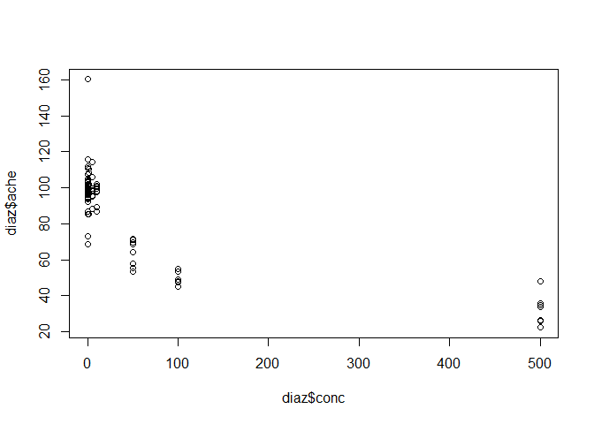
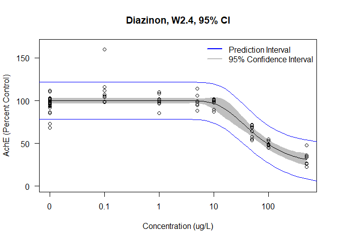
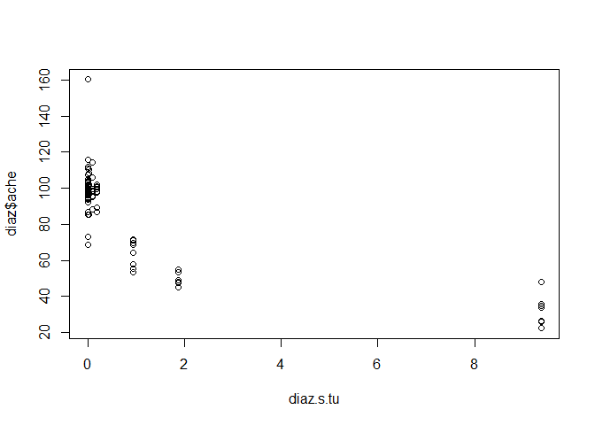
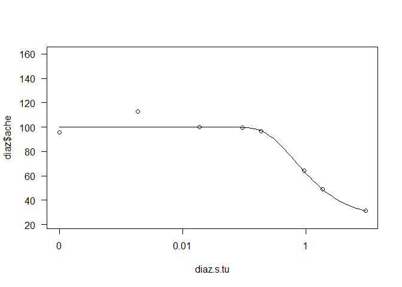

## Concentration-Response Example

In this document I use concentration-response and dose-response interchangeably. To be specific, dose-response is referring to the internal concentration within an organism and concentration-response is referring to the external concentration in an aquatic medium that the organism is exposed to. Using concentration-response is standard for aquatic toxicology and is what I am using in this analysis. The process of model fitting to the data is the same in either case.

This document follows a concentration-response analysis for organophosphate pesticide toxicity to Coho salmon for two pesticides: diazinon and malathinon. The data are from a series of toxicology experiments conducted by NOAA fisheries and provided to IETC by Cathy Laetz and David Baldwin (Laetz et al. 2009, Laetz et al. 2013).

This analysis was conducted to model single chemical and mixture toxicity for use in Bayesian network relative risk models (BN-RRM) for watersheds in Washington State to assess risk to Chinook salmon from pesticide and water quality stressors (Mitchell et al. 2020).

## drc Package

The drc package is effective for creating concentration-response models using R Statistical Software. It contains several built in models for 

link to drc package documentation

## Load in libraries and data


```r
library(drc)
library(dplyr) # data organization package
library(plotly) # for 3d scatterplot

diaz <- read.csv("Diazinon_R.csv") # Diazinon Data
mala <- read.csv("Malathion_R.csv") # Malathion Data
mdmix <- read.csv("donmon_R.csv") # Mixture Data
```

## Diazinon Concentration-Response


```r
# Using only 2005 data
diaz <- diaz %>%
  filter(Year == "2005")

summary(diaz)
```

```
##    Exposure         Concentration           conc             ache       
##  Length:80          Length:80          Min.   :  0.00   Min.   : 22.42  
##  Class :character   Class :character   1st Qu.:  0.00   1st Qu.: 67.45  
##  Mode  :character   Mode  :character   Median :  3.00   Median : 96.22  
##                                        Mean   : 66.61   Mean   : 84.05  
##                                        3rd Qu.: 50.00   3rd Qu.:100.98  
##                                        Max.   :500.00   Max.   :160.14  
##    Control               Year     
##  Length:80          Min.   :2005  
##  Class :character   1st Qu.:2005  
##  Mode  :character   Median :2005  
##                     Mean   :2005  
##                     3rd Qu.:2005  
##                     Max.   :2005
```

```r
# Plot data for visual inspection

plot(diaz$ache~diaz$conc)
```

<!-- -->


## Dose-Response Model

The drm function is the dose-response model fitting function as part of the drc package. The fct parameter selects which dose-response model to use. These models are built into the drc package. See the attached pdfs for the drc package documentation that goes into detail about the different models and their equations. LL.3 is the log-logistic 3 parameter model and W2.4 is the Weibull type 2, 4 parameter model.

There are a lot of different models available. I have heard different things from different people when it comes to selection criteria on which models to consider. The main criteria that I used is whether to include hormesis models, which I haven't included because I haven't had to model any dose-response data that had evidence of hormesis. I used this particular selection of models when I was doing a senior thesis research project with Ruth as an undergrad and have generally stuck with it for model fitting in R. In short, for model fitting use the model that fits your data best and also makes sense for your data. Log-logistic and Weibull models are commonly used for toxicology. The EXD models are exponential models but I don't think I have ever ended up selecting them.

The mselect function takes a drm object as input and recreates the drm object using a list of models to provide best fit criteria. The reason the drm function is first in the code is because there needs to be a drm model in order to use the mselect function. When I first create a drm object I use the LL.3 (Log-logistic 3 parameter) model. I then use the mselect to see if I should use a different model instead based on the lowest residual variance. I then go back and change the fct parameter on the drm function and rerun the code if needed.


```r
############################## Model Construction

diaz.mod <- drm(diaz$ache~diaz$conc, fct=W2.4())

############################## Model Selection

mselect(diaz.mod, list(LL.3(), LL.4(), LL.5(), EXD.2(), EXD.3(), W1.3(), W1.4(), W2.3(), W2.4()) )
```

```
##          logLik       IC  Lack of fit  Res var
## W2.4  -301.5640 613.1281 3.349221e-03 115.8756
## W2.4  -301.5640 613.1281 3.349221e-03 115.8756
## LL.4  -301.7924 613.5849 2.783246e-03 116.5391
## EXD.3 -303.0637 614.1274 2.257589e-03 118.7401
## W1.4  -302.4774 614.9548 1.592663e-03 118.5520
## LL.5  -301.5563 615.1127 1.339363e-03 117.3980
## W2.3  -303.5703 615.1407 1.514657e-03 120.2536
## LL.3  -307.9265 623.8529 4.459004e-05 134.0892
## W1.3  -312.2308 632.4615 1.226216e-06 149.3232
## EXD.2 -324.2448 654.4897 1.239631e-10 199.0511
```

```r
#### W2.4 selected for best fit

############################## Prediction interval
```

## Prediction Intervals

The drc package does not automatically calculate prediction intervals like it does for confidence intervals when graphing so here I am use the predict function to create predictions along the drm model.

pre.seq is a sequence of x values to create predictions from.

pre.d is the dataframe that I am putting the prediction data into.

pre.p are the predictions calculated from the predict function using the pre.d dataframe that contains pre.d$conc which are the x values from pre.seq.

    # Add predictions to dataframe
    pre.d$p <- pre.p[,1]
    pre.d$p.l <- pre.p[,2]
    pre.d$p.u <- pre.p[,3]


This code is individually taking the columns out of the pre.p predictions object and putting them into the pre.d dataframe. p.l are the lower predictions and p.u are the upper predictions. The bracket notation is used in R to select data from a dataframe: [row, column]

pre.p[1,1] is the same as saying: select the data from the first row and first column. This is a single value.
pre.p[2,3] is select the data from the second row and third column.
pre.p[,3] by not putting a number for the row, you are selecting the entire column. This is saying select the entire 3rd column. The output of this code is a vector containing all the values in the third column of this dataframe. Don't forget the comma when you use this.


```r
################### Sequence of doses to predict

# Create a sequence of x values to make predictions from
pre.seq <- exp(seq(log(0.00001), log(1000), length = 100))

# Create a data frame with x values
pre.d <- expand.grid(conc = pre.seq)

# Make predictions
pre.p <- predict(diaz.mod, newdata = pre.d, interval = "prediction")

# Add predictions to dataframe
pre.d$p <- pre.p[,1]
pre.d$p.l <- pre.p[,2]
pre.d$p.u <- pre.p[,3]
pre.d
```

```
##             conc        p       p.l       p.u
## 1   1.000000e-05 99.93955 78.268701 121.61041
## 2   1.204504e-05 99.93955 78.268701 121.61041
## 3   1.450829e-05 99.93955 78.268701 121.61041
## 4   1.747528e-05 99.93955 78.268701 121.61041
## 5   2.104904e-05 99.93955 78.268701 121.61041
## 6   2.535364e-05 99.93955 78.268701 121.61041
## 7   3.053856e-05 99.93955 78.268701 121.61041
## 8   3.678380e-05 99.93955 78.268701 121.61041
## 9   4.430621e-05 99.93955 78.268701 121.61041
## 10  5.336699e-05 99.93955 78.268701 121.61041
## 11  6.428073e-05 99.93955 78.268701 121.61041
## 12  7.742637e-05 99.93955 78.268701 121.61041
## 13  9.326033e-05 99.93955 78.268701 121.61041
## 14  1.123324e-04 99.93955 78.268701 121.61041
## 15  1.353048e-04 99.93955 78.268701 121.61041
## 16  1.629751e-04 99.93955 78.268701 121.61041
## 17  1.963041e-04 99.93955 78.268701 121.61041
## 18  2.364489e-04 99.93955 78.268701 121.61041
## 19  2.848036e-04 99.93955 78.268701 121.61041
## 20  3.430469e-04 99.93955 78.268701 121.61041
## 21  4.132012e-04 99.93955 78.268701 121.61041
## 22  4.977024e-04 99.93955 78.268701 121.61041
## 23  5.994843e-04 99.93955 78.268701 121.61041
## 24  7.220809e-04 99.93955 78.268701 121.61041
## 25  8.697490e-04 99.93955 78.268701 121.61041
## 26  1.047616e-03 99.93955 78.268701 121.61041
## 27  1.261857e-03 99.93955 78.268701 121.61041
## 28  1.519911e-03 99.93955 78.268701 121.61041
## 29  1.830738e-03 99.93955 78.268701 121.61041
## 30  2.205131e-03 99.93955 78.268701 121.61041
## 31  2.656088e-03 99.93955 78.268701 121.61041
## 32  3.199267e-03 99.93955 78.268701 121.61041
## 33  3.853529e-03 99.93955 78.268701 121.61041
## 34  4.641589e-03 99.93955 78.268701 121.61041
## 35  5.590810e-03 99.93955 78.268701 121.61041
## 36  6.734151e-03 99.93955 78.268701 121.61041
## 37  8.111308e-03 99.93955 78.268701 121.61041
## 38  9.770100e-03 99.93955 78.268701 121.61041
## 39  1.176812e-02 99.93955 78.268701 121.61041
## 40  1.417474e-02 99.93955 78.268701 121.61041
## 41  1.707353e-02 99.93955 78.268701 121.61041
## 42  2.056512e-02 99.93955 78.268701 121.61041
## 43  2.477076e-02 99.93955 78.268701 121.61041
## 44  2.983647e-02 99.93955 78.268701 121.61041
## 45  3.593814e-02 99.93955 78.268701 121.61041
## 46  4.328761e-02 99.93955 78.268701 121.61041
## 47  5.214008e-02 99.93955 78.268701 121.61041
## 48  6.280291e-02 99.93955 78.268701 121.61041
## 49  7.564633e-02 99.93955 78.268701 121.61041
## 50  9.111628e-02 99.93955 78.268701 121.61041
## 51  1.097499e-01 99.93955 78.268701 121.61041
## 52  1.321941e-01 99.93955 78.268701 121.61041
## 53  1.592283e-01 99.93955 78.268701 121.61041
## 54  1.917910e-01 99.93955 78.268701 121.61041
## 55  2.310130e-01 99.93955 78.268701 121.61041
## 56  2.782559e-01 99.93955 78.268701 121.61041
## 57  3.351603e-01 99.93955 78.268701 121.61041
## 58  4.037017e-01 99.93955 78.268701 121.61041
## 59  4.862602e-01 99.93955 78.268701 121.61041
## 60  5.857021e-01 99.93955 78.268701 121.61041
## 61  7.054802e-01 99.93955 78.268701 121.61041
## 62  8.497534e-01 99.93955 78.268701 121.61041
## 63  1.023531e+00 99.93955 78.268701 121.61041
## 64  1.232847e+00 99.93955 78.268701 121.61041
## 65  1.484968e+00 99.93955 78.268702 121.61040
## 66  1.788650e+00 99.93954 78.268708 121.61037
## 67  2.154435e+00 99.93937 78.268720 121.61002
## 68  2.595024e+00 99.93817 78.268523 121.60782
## 69  3.125716e+00 99.93199 78.266227 121.59775
## 70  3.764936e+00 99.90775 78.252347 121.56315
## 71  4.534879e+00 99.83269 78.193462 121.47192
## 72  5.462277e+00 99.64235 78.002600 121.28210
## 73  6.579332e+00 99.23491 77.514420 120.95540
## 74  7.924829e+00 98.47942 76.510455 120.44838
## 75  9.545485e+00 97.23901 74.815592 119.66242
## 76  1.149757e+01 95.40176 72.398517 118.40501
## 77  1.384886e+01 92.90765 69.377577 116.43772
## 78  1.668101e+01 89.76247 65.932372 113.59258
## 79  2.009233e+01 86.03602 62.209296 109.86274
## 80  2.420128e+01 81.84753 58.284152 105.41091
## 81  2.915053e+01 77.34483 54.181746 100.50791
## 82  3.511192e+01 72.68316 49.921010  95.44530
## 83  4.229243e+01 68.00795 45.552698  90.46320
## 84  5.094138e+01 63.44343 41.169656  85.71721
## 85  6.135907e+01 59.08694 36.889386  81.28449
## 86  7.390722e+01 55.00789 32.824713  77.19107
## 87  8.902151e+01 51.24990 29.060218  73.43959
## 88  1.072267e+02 47.83467 25.642561  70.02679
## 89  1.291550e+02 44.76652 22.582981  66.95007
## 90  1.555676e+02 42.03689 19.866384  64.20739
## 91  1.873817e+02 39.62829 17.461984  61.79460
## 92  2.257020e+02 37.51768 15.332513  59.70284
## 93  2.718588e+02 35.67897 13.440780  57.91717
## 94  3.274549e+02 34.08505 11.753507  56.41660
## 95  3.944206e+02 32.70908 10.242904  55.17525
## 96  4.750810e+02 31.52543  8.886723  54.16414
## 97  5.722368e+02 30.51024  7.667458  53.35303
## 98  6.892612e+02 29.64173  6.571236  52.71222
## 99  8.302176e+02 28.90027  5.586742  52.21379
## 100 1.000000e+03 28.26840  4.704353  51.83245
```

```r
summary(pre.d)
```

```
##       conc                 p              p.l              p.u        
##  Min.   :   0.0000   Min.   :28.27   Min.   : 4.704   Min.   : 51.83  
##  1st Qu.:   0.0010   1st Qu.:96.78   1st Qu.:74.211   1st Qu.:119.35  
##  Median :   0.1004   Median :99.94   Median :78.269   Median :121.61  
##  Mean   :  58.8989   Mean   :88.46   Mean   :66.514   Mean   :110.41  
##  3rd Qu.:  10.0335   3rd Qu.:99.94   3rd Qu.:78.269   3rd Qu.:121.61  
##  Max.   :1000.0000   Max.   :99.94   Max.   :78.269   Max.   :121.61
```

```r
# Make models for upper and lower predictions

pre.l.m <- drm(pre.d$p.l~pre.d$conc, fct = W2.4())
pre.u.m <- drm(pre.d$p.u ~ pre.d$conc, fct = W2.4())
```

## Concentration-Response Figure


```r
############################## Figure for Diazinon

plot(diaz.mod, type = "confidence", ylab = "AchE (Percent Control)",
     xlab = "Concentration (ug/L)",
     ylim = c(0,165),
     main = "Diazinon, W2.4, 95% CI")
plot(diaz.mod, type = "all", add = TRUE)

#Prediction Interval

plot(pre.l.m, add = TRUE, type = "none", col = "blue")
plot(pre.u.m, add=TRUE, type = "none", col = "blue")

#Legend

legend("topright", c("Prediction Interval", "95% Confidence Interval"),
       lty=c(1,1),
       lwd=c(2.5,2.5), 
       col=c('blue', 'gray'),
       bty = "n")
```

<!-- -->

```r
############################## Model Parameters

diaz.mod
```

```
## 
## A 'drc' model.
## 
## Call:
## drm(formula = diaz$ache ~ diaz$conc, fct = W2.4())
## 
## Coefficients:
## b:(Intercept)  c:(Intercept)  d:(Intercept)  e:(Intercept)  
##       -0.9116        24.7515        99.9396        35.6787
```

```r
# Call:
#   drm(formula = diaz$ache ~ diaz$conc, fct = W2.4())
# 
#   Coefficients:
#   b:(Intercept)  c:(Intercept)  d:(Intercept)  e:(Intercept)  
#        -0.9116        24.7515        99.9396        35.6787   

summary(diaz.mod)
```

```
## 
## Model fitted: Weibull (type 2) (4 parms)
## 
## Parameter estimates:
## 
##               Estimate Std. Error t-value   p-value    
## b:(Intercept) -0.91160    0.27274 -3.3423  0.001291 ** 
## c:(Intercept) 24.75148    7.83318  3.1598  0.002267 ** 
## d:(Intercept) 99.93955    1.58577 63.0226 < 2.2e-16 ***
## e:(Intercept) 35.67869    6.67792  5.3428 9.238e-07 ***
## ---
## Signif. codes:  0 '***' 0.001 '**' 0.01 '*' 0.05 '.' 0.1 ' ' 1
## 
## Residual standard error:
## 
##  10.76455 (76 degrees of freedom)
```

```r
################################ Diazinon EC50

diaz.ec <- ED(diaz.mod, c(5, 10, 20, 50), interval = "delta")
```

```
## 
## Estimated effective doses
## 
##        Estimate Std. Error   Lower   Upper
## e:1:5   10.7078     4.2001  2.3426 19.0729
## e:1:10  14.2912     4.5578  5.2135 23.3689
## e:1:20  21.1686     4.9518 11.3062 31.0311
## e:1:50  53.3358    12.2935 28.8511 77.8204
```

```r
diaz.ec
```

```
##        Estimate Std. Error     Lower    Upper
## e:1:5  10.70776   4.200054  2.342631 19.07289
## e:1:10 14.29120   4.557832  5.213488 23.36891
## e:1:20 21.16865   4.951843 11.306200 31.03110
## e:1:50 53.33579  12.293507 28.851149 77.82043
```

```r
#       Estimate Std. Error   Lower   Upper
# e:1:5   10.7078     4.2001  2.3426 19.0729
# e:1:10  14.2912     4.5578  5.2135 23.3689
# e:1:20  21.1686     4.9518 11.3062 31.0311
# e:1:50  53.3358    12.2935 28.8511 77.8204

ec50.d <- 53.3358

################################ Diazinon Toxic Units

diaz.s.tu <- diaz$conc / ec50.d
plot(diaz$ache ~ diaz.s.tu)
```

<!-- -->

```r
diaz.s.tu.m <- drm(diaz$ache ~ diaz.s.tu, fct=W2.4())
plot(diaz.s.tu.m)
```

<!-- -->


