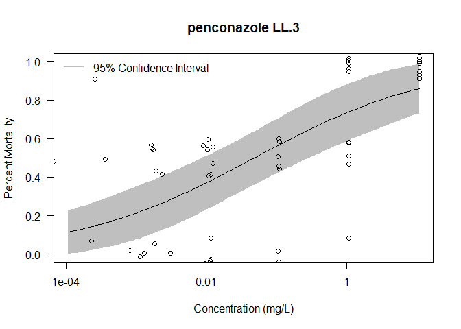

# Concentration-Response Models

The following concentration-response models were constructed using the data supplied by Hutton et al. (2021) who analyzed the effect of salinity on the toxicity of seven pesticides to silversides (*Menidia beryllina*). The data were available online as part of the supplemental materials.

Data points plotted in the figures have been jittered, or moved around slightly, on x and y axes so that all they are not all stacked on each other.

Hutton, SJ, St. Romain SJ, Pedersen EL, Siddiqui S, Chappell PE, White JW, Armbrust KL, Brander SM. 2021. Salinity alters toxicity of commonly used pesticides in a model euryhaline fish species (*Menidia beryllina*). *Toxics* 9:114.

## drc Model

I used the Log Logistic 3 parameter model included in the drc package to plot the curves. I used the binomial type and fixed the upper limit to 1 (100% mortality).

Log-logistic 3 parameter model:

$f(x) = 0+\frac{d-0}{(1+exp(b(log(x)-e)))}$

where

$d$ = 1 to fix the upper limit to 1

$e$ = LC50

To use this equation in Netica we need to estimate the $b$ and $e$ parameters.

## Salinity

Hutton et al. (2020) used two sets of experiments using 5 PSU and 15 PSU Salinity. I have combined the data from the two salinity values to incorporate uncertainty along a salinity gradient. Hutton et al. (2020) also did not find significant differences between the different salinity models.

## R Code

<details>
  <summary><b>R Code</b></summary>
  

```r
library(drc)
library(tidyverse)

smelt <- read.csv("smelt_range_finding_survival_data.csv")


drc.plot <- function (cont) {
  
  ## filter for chemical
  filt <- smelt %>%
  filter(chemical == cont) %>%
  mutate(percent_m = dead / total)
  
  ## Create model
  mod <- drm(filt$percent_m ~ filt$dose.adj, fct = LL.3(fixed = c(NA, 1, NA)), type = "binomial")
  
  ## Plot curve
  
  par(mfrow=c(2,2))
  
  plot(mod, type = "confidence", ylab = "Percent Mortality",
     xlab = "Concentration (mg/L)",
     main = paste(cont, "LL.3"))
  #plot(mod, type = "all", add = TRUE)
  
  y <- jitter(filt$percent_m)
  x <- jitter(filt$dose.adj)
  
  points(y ~ x)


  #Legend
  
  legend("topleft", c("95% Confidence Interval"),
         lty=c(1,1),
         lwd=c(2.5,2.5), 
         col=c('gray'),
         bty = "n",
         cex = 0.8)
  
  ## QA/QC
  
  qqnorm(resid(mod))
  
  
  qqline(resid(mod))
  
  plot(resid(mod)~predict(mod), main = "Residuals")
  abline(h=0)
  
  ############################## Model Parameters

  sum <- summary(mod)
  print(sum)
  
  ################################ EC50

  mod.ec <- ED(mod, c(5, 10, 20, 50), interval = "delta")
  
}

drc.plot.sal <- function (cont) {
  
  ## filter for chemical
  filt <- smelt %>%
  filter(chemical == cont) %>%
  mutate(percent_m = dead / total)
  
  ## Create models
  mod.5 <- drm(filt$percent_m[filt$salinity == 5] ~ filt$dose.adj[filt$salinity == 5], fct = LL.3(fixed = c(NA, 1, NA)), type = "binomial")
  
  mod.15 <- drm(filt$percent_m[filt$salinity == 15] ~ filt$dose.adj[filt$salinity == 15], fct = LL.3(fixed = c(NA, 1, NA)), type = "binomial")
  
  ## Plot curves
  
  plot(mod.5, type = "confidence", ylab = "Percent Mortality",
     xlab = "Concentration (mg/L)",
     main = paste(cont, "LL.3, Salinity"),
     col = "orange")
  #plot(mod.5, type = "all", col = "orange", add = TRUE)
  y.5 <- jitter(filt$percent_m[filt$salinity == 5])
  x.5 <- jitter(filt$dose.adj[filt$salinity == 5])
  points(y.5 ~ x.5, col = "orange")
  
  
  plot(mod.15, type = "confidence", ylab = "Percent Mortality",
     xlab = "Concentration (mg/L)",
     main = paste(cont, "LL.3"),
     col = "blue",
     add = TRUE)
  #plot(mod.15, type = "all", col = "blue", add = TRUE)
  y.15 <- jitter(filt$percent_m[filt$salinity == 15])
  x.15 <- jitter(filt$dose.adj[filt$salinity == 15])
  
  points(y.15 ~ x.15, col = "blue")
  


  #Legend
  
  legend("topleft", c("5 PSU Salinity","15 PSU Salinity"),
         lty=c(1,1),
         lwd=c(2.5,2.5), 
         col=c('orange', "blue"),
         bty = "n",
         cex = 0.8)


  
}
```

</details>
<br><br>

# Bifenthrin

Model Equation

$f(x) = 0+\frac{1-0}{(1+exp(-0.85959(log(x)-0.000013751)))}$


```r
drc.plot("bifenthrin")
```

```
## 
## Model fitted: Log-logistic (ED50 as parameter) with lower limit at 0 (2 parms)
## 
## Parameter estimates:
## 
##                  Estimate  Std. Error t-value   p-value    
## b:(Intercept) -8.5959e-01  1.9725e-01 -4.3579 1.313e-05 ***
## e:(Intercept)  1.3751e-04  5.6452e-05  2.4359   0.01485 *  
## ---
## Signif. codes:  0 '***' 0.001 '**' 0.01 '*' 0.05 '.' 0.1 ' ' 1
## 
## Estimated effective doses
## 
##           Estimate  Std. Error       Lower       Upper
## e:1:5   4.4742e-06  4.2521e-06 -3.8597e-06  1.2808e-05
## e:1:10  1.0672e-05  8.2645e-06 -5.5264e-06  2.6870e-05
## e:1:20  2.7412e-05  1.6458e-05 -4.8455e-06  5.9670e-05
## e:1:50  1.3751e-04  5.6452e-05  2.6869e-05  2.4816e-04
```

```r
drc.plot.sal("bifenthrin")
```

<!-- -->

# Chlorpyrifos

Model Equation

$f(x) = 0+\frac{1-0}{(1+exp(-0.5273(log(x)-0.004397)))}$


```r
drc.plot("chlorpyrifos")
```

```
## 
## Model fitted: Log-logistic (ED50 as parameter) with lower limit at 0 (2 parms)
## 
## Parameter estimates:
## 
##                 Estimate Std. Error t-value   p-value    
## b:(Intercept) -0.5273495  0.1158705 -4.5512 5.334e-06 ***
## e:(Intercept)  0.0043972  0.0027287  1.6115    0.1071    
## ---
## Signif. codes:  0 '***' 0.001 '**' 0.01 '*' 0.05 '.' 0.1 ' ' 1
## 
## Estimated effective doses
## 
##           Estimate  Std. Error       Lower       Upper
## e:1:5   1.6531e-05  2.2063e-05 -2.6712e-05  5.9775e-05
## e:1:10  6.8182e-05  7.2861e-05 -7.4622e-05  2.1099e-04
## e:1:20  3.1733e-04  2.5925e-04 -1.9079e-04  8.2544e-04
## e:1:50  4.3972e-03  2.7287e-03 -9.5091e-04  9.7453e-03
```

```r
drc.plot.sal("chlorpyrifos")
```

<!-- -->

# Dicloran

Model Equation

$f(x) = 0+\frac{1-0}{(1+exp(-0.6628(log(x)-0.003734)))}$


```r
drc.plot("dicloran")
```

```
## 
## Model fitted: Log-logistic (ED50 as parameter) with lower limit at 0 (2 parms)
## 
## Parameter estimates:
## 
##                 Estimate Std. Error t-value  p-value    
## b:(Intercept) -0.6627503  0.1524596 -4.3471 1.38e-05 ***
## e:(Intercept)  0.0037340  0.0020496  1.8218  0.06849 .  
## ---
## Signif. codes:  0 '***' 0.001 '**' 0.01 '*' 0.05 '.' 0.1 ' ' 1
## 
## Estimated effective doses
## 
##           Estimate  Std. Error       Lower       Upper
## e:1:5   4.3925e-05  5.3009e-05 -5.9970e-05  1.4782e-04
## e:1:10  1.3563e-04  1.3327e-04 -1.2557e-04  3.9683e-04
## e:1:20  4.6105e-04  3.5260e-04 -2.3004e-04  1.1521e-03
## e:1:50  3.7340e-03  2.0496e-03 -2.8320e-04  7.7513e-03
```

```r
drc.plot.sal("dicloran")
```

<!-- -->

# Myclobutanil

Model Equation

$f(x) = 0+\frac{1-0}{(1+exp(-0.3286(log(x)-2.315)))}$


```r
drc.plot("myclobutanil")
```

```
## 
## Model fitted: Log-logistic (ED50 as parameter) with lower limit at 0 (2 parms)
## 
## Parameter estimates:
## 
##                Estimate Std. Error t-value   p-value    
## b:(Intercept) -0.328631   0.087476 -3.7568 0.0001721 ***
## e:(Intercept)  2.314804   2.220705  1.0424 0.2972385    
## ---
## Signif. codes:  0 '***' 0.001 '**' 0.01 '*' 0.05 '.' 0.1 ' ' 1
## 
## Estimated effective doses
## 
##           Estimate  Std. Error       Lower       Upper
## e:1:5   0.00029741  0.00065008 -0.00097672  0.00157154
## e:1:10  0.00288950  0.00476691 -0.00645348  0.01223247
## e:1:20  0.03407912  0.03914345 -0.04264062  0.11079887
## e:1:50  2.31480393  2.22070471 -2.03769732  6.66730519
```

```r
drc.plot.sal("myclobutanil")
```

<!-- -->

# Paraquat

Model Equation

$f(x) = 0+\frac{1-0}{(1+exp(-0.3334(log(x)-26.1204)))}$


```r
drc.plot("paraquat")
```

```
## 
## Model fitted: Log-logistic (ED50 as parameter) with lower limit at 0 (2 parms)
## 
## Parameter estimates:
## 
##                Estimate Std. Error t-value   p-value    
## b:(Intercept) -0.333444   0.086686 -3.8466 0.0001198 ***
## e:(Intercept) 26.120380  23.941504  1.0910 0.2752692    
## ---
## Signif. codes:  0 '***' 0.001 '**' 0.01 '*' 0.05 '.' 0.1 ' ' 1
## 
## Estimated effective doses
## 
##           Estimate  Std. Error       Lower       Upper
## e:1:5    0.0038194   0.0082499  -0.0123500   0.0199888
## e:1:10   0.0359091   0.0589694  -0.0796688   0.1514871
## e:1:20   0.4086964   0.4710102  -0.5144666   1.3318594
## e:1:50  26.1203799  23.9415043 -20.8041062  73.0448660
```

```r
drc.plot.sal("paraquat")
```

<!-- -->

# Penconazole

Model Equation

$f(x) = 0+\frac{1-0}{(1+exp(-0.3363(log(x)-0.04808)))}$


```r
drc.plot("penconazole")
```

```
## 
## Model fitted: Log-logistic (ED50 as parameter) with lower limit at 0 (2 parms)
## 
## Parameter estimates:
## 
##                Estimate Std. Error t-value  p-value    
## b:(Intercept) -0.336279   0.082830 -4.0599 4.91e-05 ***
## e:(Intercept)  0.048079   0.040391  1.1904   0.2339    
## ---
## Signif. codes:  0 '***' 0.001 '**' 0.01 '*' 0.05 '.' 0.1 ' ' 1
## 
## Estimated effective doses
## 
##           Estimate  Std. Error       Lower       Upper
## e:1:5   7.5737e-06  1.7226e-05 -2.6188e-05  4.1336e-05
## e:1:10  6.9873e-05  1.2418e-04 -1.7352e-04  3.1326e-04
## e:1:20  7.7911e-04  1.0008e-03 -1.1825e-03  2.7407e-03
## e:1:50  4.8079e-02  4.0391e-02 -3.1085e-02  1.2724e-01
```

```r
drc.plot.sal("penconazole")
```

<!-- -->

# Triadimefon

Model Equation

$f(x) = 0+\frac{1-0}{(1+exp(-0.6433(log(x)-0.7734)))}$


```r
drc.plot("triadimefon")
```

```
## 
## Model fitted: Log-logistic (ED50 as parameter) with lower limit at 0 (2 parms)
## 
## Parameter estimates:
## 
##               Estimate Std. Error t-value   p-value    
## b:(Intercept) -0.64331    0.14133 -4.5519 5.316e-06 ***
## e:(Intercept)  0.77335    0.42687  1.8117   0.07003 .  
## ---
## Signif. codes:  0 '***' 0.001 '**' 0.01 '*' 0.05 '.' 0.1 ' ' 1
## 
## Estimated effective doses
## 
##          Estimate Std. Error      Lower      Upper
## e:1:5   0.0079543  0.0089670 -0.0096206  0.0255293
## e:1:10  0.0254123  0.0232098 -0.0200781  0.0709028
## e:1:20  0.0896394  0.0638674 -0.0355384  0.2148172
## e:1:50  0.7733543  0.4268685 -0.0632926  1.6100012
```

```r
drc.plot.sal("triadimefon")
```

<!-- -->

<details>
  <summary><b>R Session Information</b></summary>

```r
xfun::session_info('rmarkdown')
```

```
## R version 4.0.2 (2020-06-22)
## Platform: i386-w64-mingw32/i386 (32-bit)
## Running under: Windows 10 x64 (build 18363)
## 
## Locale:
##   LC_COLLATE=English_United States.1252 
##   LC_CTYPE=English_United States.1252   
##   LC_MONETARY=English_United States.1252
##   LC_NUMERIC=C                          
##   LC_TIME=English_United States.1252    
## 
## Package version:
##   base64enc_0.1.3 digest_0.6.25   evaluate_0.14   glue_1.4.1     
##   graphics_4.0.2  grDevices_4.0.2 highr_0.8       htmltools_0.5.0
##   jsonlite_1.7.1  knitr_1.29      magrittr_1.5    markdown_1.1   
##   methods_4.0.2   mime_0.9        rlang_0.4.7     rmarkdown_2.5  
##   stats_4.0.2     stringi_1.4.6   stringr_1.4.0   tinytex_0.25   
##   tools_4.0.2     utils_4.0.2     xfun_0.16       yaml_2.2.1     
## 
## Pandoc version: 2.7.3
```
</details>
<br><br>

