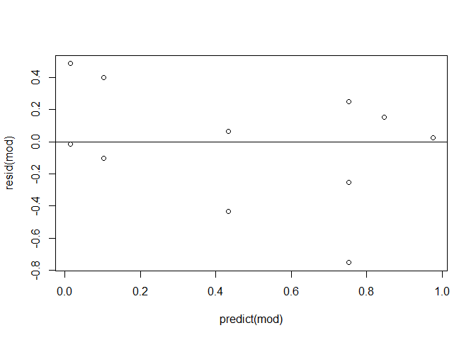
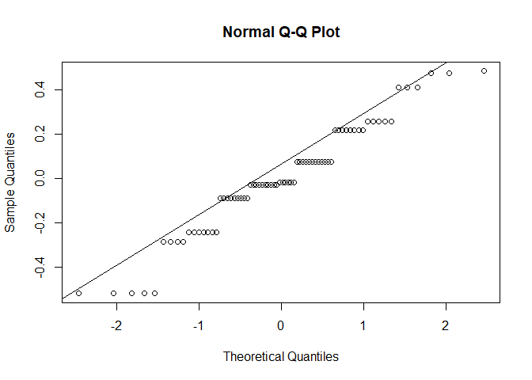
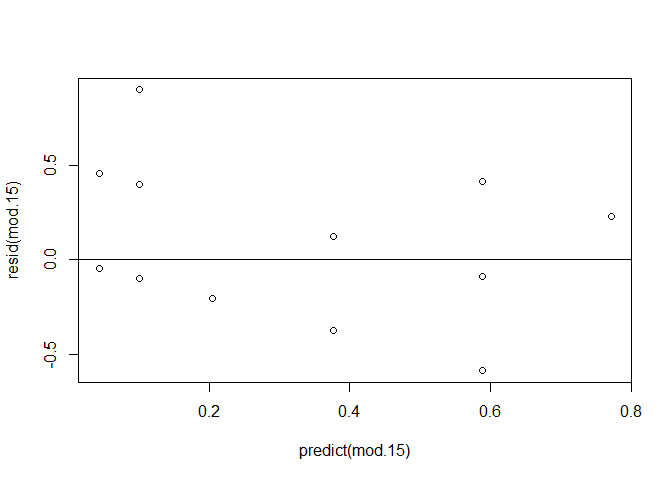

```r
library(drc)
library(tidyverse)

smelt <- read.csv("smelt_range_finding_survival_data.csv")
```

# Dose Response Plots


```r
drc.plot <- function (cont) {
  
  ## filter for chemical
  filt <- smelt %>%
  filter(chemical == cont) %>%
  mutate(percent_m = dead / total)
  
  ## Create model
  mod <- drm(filt$percent_m ~ filt$dose.adj, fct = LL.3(fixed = c(NA, 1, NA)), type = "binomial")
  
  ## Plot curve
  
  plot(mod, type = "confidence", ylab = "Percent Mortality",
     xlab = "Concentration (mg/L)",
     main = paste(cont, "LL.3"))
  #plot(mod, type = "all", add = TRUE)
  
  y <- jitter(filt$percent_m)
  x <- jitter(filt$dose.adj)
  
  points(y ~ x)


  #Legend
  
  legend("topleft", c("95% Confidence Interval"),
         lty=c(1,1),
         lwd=c(2.5,2.5), 
         col=c('gray'),
         bty = "n")
  
  ## Model fit
  mod.fit <- mselect(mod, list(LL.3()))
  print(mod.fit)
  
  ## QA/QC
  
  qqnorm(resid(mod))
  
  
  qqline(resid(mod))
  
  plot(resid(mod)~predict(mod))
  abline(h=0)
  
  ############################## Model Parameters

  sum <- summary(mod)
  print(sum)
  
  ################################ EC50

  mod.ec <- ED(mod, c(5, 10, 20, 50), interval = "delta")
  
}

drc.plot.sal <- function (cont) {
  
  ## filter for chemical
  filt <- smelt %>%
  filter(chemical == cont) %>%
  mutate(percent_m = dead / total)
  
  ## Create models
  mod.5 <- drm(filt$percent_m[filt$salinity == 5] ~ filt$dose.adj[filt$salinity == 5], fct = LL.3(fixed = c(NA, 1, NA)), type = "binomial")
  
  mod.15 <- drm(filt$percent_m[filt$salinity == 15] ~ filt$dose.adj[filt$salinity == 15], fct = LL.3(fixed = c(NA, 1, NA)), type = "binomial")
  
  ## Plot curves
  
  plot(mod.5, type = "confidence", ylab = "Percent Mortality",
     xlab = "Concentration (mg/L)",
     main = paste(cont, "LL.3"),
     col = "orange")
  #plot(mod.5, type = "all", col = "orange", add = TRUE)
  y.5 <- jitter(filt$percent_m[filt$salinity == 5])
  x.5 <- jitter(filt$dose.adj[filt$salinity == 5])
  points(y.5 ~ x.5, col = "orange")
  
  
  plot(mod.15, type = "confidence", ylab = "Percent Mortality",
     xlab = "Concentration (mg/L)",
     main = paste(cont, "LL.3"),
     col = "blue",
     add = TRUE)
  #plot(mod.15, type = "all", col = "blue", add = TRUE)
  y.15 <- jitter(filt$percent_m[filt$salinity == 15])
  x.15 <- jitter(filt$dose.adj[filt$salinity == 15])
  
  points(y.15 ~ x.15, col = "blue")
  


  #Legend
  
  legend("topleft", c("5 PSU Salinity","15 PSU Salinity"),
         lty=c(1,1),
         lwd=c(2.5,2.5), 
         col=c('orange', "blue"),
         bty = "n")
  
  ## Model fit
  mod.fit.5 <- mselect(mod.5, list(LL.3()))
  print(mod.fit.5)
  
  mod.fit.15 <- mselect(mod.15, list(LL.3()))
  print(mod.fit.15)
  
  ## QA/QC
  
  qqnorm(resid(mod.5))
  qqnorm(resid(mod.15))
  
  qqline(resid(mod.5))
  qqline(resid(mod.15))
  
  plot(resid(mod.5)~predict(mod.5))
  abline(h=0)
  
  sum.5 <- summary(mod.5)
  sum.5
  
  plot(resid(mod.15)~predict(mod.15))
  abline(h=0)
  
  ############################## Model Parameters

  
  
  sum.15 <- summary(mod.15)
  sum.15
  
  ################################ EC50

  mod.ec.5 <- ED(mod.5, c(5, 10, 20, 50), interval = "delta")
  mod.ec.15 <- ED(mod.5, c(5, 10, 20, 50), interval = "delta")
  
}
```

## Bifenthrin


```r
drc.plot("bifenthrin")
```

<!-- -->

```
##         logLik       IC Lack of fit
## LL.3 -26.32041 56.64081   0.7915266
## LL.3        NA       NA          NA
```

<!-- --><!-- -->

```
## 
## Model fitted: Log-logistic (ED50 as parameter) with lower limit at 0 (2 parms)
## 
## Parameter estimates:
## 
##                  Estimate  Std. Error t-value   p-value    
## b:(Intercept) -8.5959e-01  1.9725e-01 -4.3579 1.313e-05 ***
## e:(Intercept)  1.3751e-04  5.6452e-05  2.4359   0.01485 *  
## ---
## Signif. codes:  0 '***' 0.001 '**' 0.01 '*' 0.05 '.' 0.1 ' ' 1
## 
## Estimated effective doses
## 
##           Estimate  Std. Error       Lower       Upper
## e:1:5   4.4742e-06  4.2521e-06 -3.8597e-06  1.2808e-05
## e:1:10  1.0672e-05  8.2645e-06 -5.5264e-06  2.6870e-05
## e:1:20  2.7412e-05  1.6458e-05 -4.8455e-06  5.9670e-05
## e:1:50  1.3751e-04  5.6452e-05  2.6869e-05  2.4816e-04
```

```r
drc.plot.sal("bifenthrin")
```

<!-- -->

```
##         logLik       IC Lack of fit
## LL.3 -10.81001 25.62003   0.9892253
## LL.3        NA       NA          NA
##         logLik       IC Lack of fit
## LL.3 -15.00074 34.00148   0.8026162
## LL.3        NA       NA          NA
```

<!-- --><!-- --><!-- --><!-- -->

```
## 
## Estimated effective doses
## 
##           Estimate  Std. Error       Lower       Upper
## e:1:5   1.1693e-05  1.3023e-05 -1.3832e-05  3.7218e-05
## e:1:10  2.2723e-05  2.0768e-05 -1.7982e-05  6.3428e-05
## e:1:20  4.6732e-05  3.3477e-05 -1.8883e-05  1.1235e-04
## e:1:50  1.6030e-04  7.9460e-05  4.5646e-06  3.1604e-04
## 
## Estimated effective doses
## 
##           Estimate  Std. Error       Lower       Upper
## e:1:5   1.1693e-05  1.3023e-05 -1.3832e-05  3.7218e-05
## e:1:10  2.2723e-05  2.0768e-05 -1.7982e-05  6.3428e-05
## e:1:20  4.6732e-05  3.3477e-05 -1.8883e-05  1.1235e-04
## e:1:50  1.6030e-04  7.9460e-05  4.5646e-06  3.1604e-04
```

## Chlorpyrifos


```r
drc.plot("chlorpyrifos")
```

<!-- -->

```
##         logLik       IC Lack of fit
## LL.3 -29.60091 63.20183   0.9987335
## LL.3        NA       NA          NA
```

<!-- --><!-- -->

```
## 
## Model fitted: Log-logistic (ED50 as parameter) with lower limit at 0 (2 parms)
## 
## Parameter estimates:
## 
##                 Estimate Std. Error t-value   p-value    
## b:(Intercept) -0.5273495  0.1158705 -4.5512 5.334e-06 ***
## e:(Intercept)  0.0043972  0.0027287  1.6115    0.1071    
## ---
## Signif. codes:  0 '***' 0.001 '**' 0.01 '*' 0.05 '.' 0.1 ' ' 1
## 
## Estimated effective doses
## 
##           Estimate  Std. Error       Lower       Upper
## e:1:5   1.6531e-05  2.2063e-05 -2.6712e-05  5.9775e-05
## e:1:10  6.8182e-05  7.2861e-05 -7.4622e-05  2.1099e-04
## e:1:20  3.1733e-04  2.5925e-04 -1.9079e-04  8.2544e-04
## e:1:50  4.3972e-03  2.7287e-03 -9.5091e-04  9.7453e-03
```

```r
drc.plot.sal("chlorpyrifos")
```

<!-- -->

```
##        logLik       IC Lack of fit
## LL.3 -14.3437 32.68741   0.9978533
## LL.3       NA       NA          NA
##         logLik       IC Lack of fit
## LL.3 -14.77361 33.54721   0.9560632
## LL.3        NA       NA          NA
```

<!-- --><!-- --><!-- --><!-- -->

```
## 
## Estimated effective doses
## 
##           Estimate  Std. Error       Lower       Upper
## e:1:5   3.4533e-05  6.3520e-05 -8.9964e-05  1.5903e-04
## e:1:10  1.3762e-04  2.0218e-04 -2.5865e-04  5.3390e-04
## e:1:20  6.1710e-04  6.9259e-04 -7.4036e-04  1.9746e-03
## e:1:50  8.0239e-03  7.0055e-03 -5.7067e-03  2.1755e-02
## 
## Estimated effective doses
## 
##           Estimate  Std. Error       Lower       Upper
## e:1:5   3.4533e-05  6.3520e-05 -8.9964e-05  1.5903e-04
## e:1:10  1.3762e-04  2.0218e-04 -2.5865e-04  5.3390e-04
## e:1:20  6.1710e-04  6.9259e-04 -7.4036e-04  1.9746e-03
## e:1:50  8.0239e-03  7.0055e-03 -5.7067e-03  2.1755e-02
```

## Dicloran


```r
drc.plot("dicloran")
```

<!-- -->

```
##         logLik       IC Lack of fit
## LL.3 -24.33319 52.66637   0.9999999
## LL.3        NA       NA          NA
```

<!-- --><!-- -->

```
## 
## Model fitted: Log-logistic (ED50 as parameter) with lower limit at 0 (2 parms)
## 
## Parameter estimates:
## 
##                 Estimate Std. Error t-value  p-value    
## b:(Intercept) -0.6627503  0.1524596 -4.3471 1.38e-05 ***
## e:(Intercept)  0.0037340  0.0020496  1.8218  0.06849 .  
## ---
## Signif. codes:  0 '***' 0.001 '**' 0.01 '*' 0.05 '.' 0.1 ' ' 1
## 
## Estimated effective doses
## 
##           Estimate  Std. Error       Lower       Upper
## e:1:5   4.3925e-05  5.3009e-05 -5.9970e-05  1.4782e-04
## e:1:10  1.3563e-04  1.3327e-04 -1.2557e-04  3.9683e-04
## e:1:20  4.6105e-04  3.5260e-04 -2.3004e-04  1.1521e-03
## e:1:50  3.7340e-03  2.0496e-03 -2.8320e-04  7.7513e-03
```

```r
drc.plot.sal("dicloran")
```

<!-- -->

```
##         logLik       IC Lack of fit
## LL.3 -11.56856 27.13712   0.9973861
## LL.3        NA       NA          NA
##         logLik       IC Lack of fit
## LL.3 -12.31775 28.63549   0.9999193
## LL.3        NA       NA          NA
```

<!-- --><!-- --><!-- --><!-- -->

```
## 
## Estimated effective doses
## 
##           Estimate  Std. Error       Lower       Upper
## e:1:5   0.00010150  0.00015733 -0.00020687  0.00040987
## e:1:10  0.00028787  0.00036394 -0.00042544  0.00100118
## e:1:20  0.00089240  0.00088386 -0.00083993  0.00262473
## e:1:50  0.00617367  0.00454727 -0.00273881  0.01508615
## 
## Estimated effective doses
## 
##           Estimate  Std. Error       Lower       Upper
## e:1:5   0.00010150  0.00015733 -0.00020687  0.00040987
## e:1:10  0.00028787  0.00036394 -0.00042544  0.00100118
## e:1:20  0.00089240  0.00088386 -0.00083993  0.00262473
## e:1:50  0.00617367  0.00454727 -0.00273881  0.01508615
```

## Myclobutanil


```r
drc.plot("myclobutanil")
```

<!-- -->

```
##         logLik       IC Lack of fit
## LL.3 -36.18174 76.36349   0.9256093
## LL.3        NA       NA          NA
```

<!-- --><!-- -->

```
## 
## Model fitted: Log-logistic (ED50 as parameter) with lower limit at 0 (2 parms)
## 
## Parameter estimates:
## 
##                Estimate Std. Error t-value   p-value    
## b:(Intercept) -0.328631   0.087476 -3.7568 0.0001721 ***
## e:(Intercept)  2.314804   2.220705  1.0424 0.2972385    
## ---
## Signif. codes:  0 '***' 0.001 '**' 0.01 '*' 0.05 '.' 0.1 ' ' 1
## 
## Estimated effective doses
## 
##           Estimate  Std. Error       Lower       Upper
## e:1:5   0.00029741  0.00065008 -0.00097672  0.00157154
## e:1:10  0.00288950  0.00476691 -0.00645348  0.01223247
## e:1:20  0.03407912  0.03914345 -0.04264062  0.11079887
## e:1:50  2.31480393  2.22070471 -2.03769732  6.66730519
```

```r
drc.plot.sal("myclobutanil")
```

<!-- -->

```
##         logLik       IC Lack of fit
## LL.3 -18.67848 41.35696   0.8548459
## LL.3        NA       NA          NA
##         logLik       IC Lack of fit
## LL.3 -17.34617 38.69235   0.7502402
## LL.3        NA       NA          NA
```

<!-- --><!-- --><!-- --><!-- -->

```
## 
## Estimated effective doses
## 
##           Estimate  Std. Error       Lower       Upper
## e:1:5   0.00013685  0.00050037 -0.00084387  0.00111757
## e:1:10  0.00183877  0.00497059 -0.00790341  0.01158095
## e:1:20  0.03083350  0.05598566 -0.07889638  0.14056338
## e:1:50  3.82219211  6.20140016 -8.33232886 15.97671308
## 
## Estimated effective doses
## 
##           Estimate  Std. Error       Lower       Upper
## e:1:5   0.00013685  0.00050037 -0.00084387  0.00111757
## e:1:10  0.00183877  0.00497059 -0.00790341  0.01158095
## e:1:20  0.03083350  0.05598566 -0.07889638  0.14056338
## e:1:50  3.82219211  6.20140016 -8.33232886 15.97671308
```

## Paraquat


```r
drc.plot("paraquat")
```

<!-- -->

```
##         logLik       IC Lack of fit
## LL.3 -36.62915 77.25831   0.9867665
## LL.3        NA       NA          NA
```

<!-- --><!-- -->

```
## 
## Model fitted: Log-logistic (ED50 as parameter) with lower limit at 0 (2 parms)
## 
## Parameter estimates:
## 
##                Estimate Std. Error t-value   p-value    
## b:(Intercept) -0.333444   0.086686 -3.8466 0.0001198 ***
## e:(Intercept) 26.120380  23.941504  1.0910 0.2752692    
## ---
## Signif. codes:  0 '***' 0.001 '**' 0.01 '*' 0.05 '.' 0.1 ' ' 1
## 
## Estimated effective doses
## 
##           Estimate  Std. Error       Lower       Upper
## e:1:5    0.0038194   0.0082499  -0.0123500   0.0199888
## e:1:10   0.0359091   0.0589694  -0.0796688   0.1514871
## e:1:20   0.4086964   0.4710102  -0.5144666   1.3318594
## e:1:50  26.1203799  23.9415043 -20.8041062  73.0448660
```

```r
drc.plot.sal("paraquat")
```

<!-- -->

```
##        logLik       IC Lack of fit
## LL.3 -17.9223 39.84459   0.9334829
## LL.3       NA       NA          NA
##         logLik       IC Lack of fit
## LL.3 -18.61382 41.22763   0.9174025
## LL.3        NA       NA          NA
```

<!-- --><!-- --><!-- --><!-- -->

```
## 
## Estimated effective doses
## 
##           Estimate  Std. Error       Lower       Upper
## e:1:5    0.0059301   0.0177938  -0.0289452   0.0408054
## e:1:10   0.0545624   0.1239331  -0.1883421   0.2974668
## e:1:20   0.6066135   0.9642582  -1.2832978   2.4965249
## e:1:50  37.2471700  49.1035030 -58.9939274 133.4882674
## 
## Estimated effective doses
## 
##           Estimate  Std. Error       Lower       Upper
## e:1:5    0.0059301   0.0177938  -0.0289452   0.0408054
## e:1:10   0.0545624   0.1239331  -0.1883421   0.2974668
## e:1:20   0.6066135   0.9642582  -1.2832978   2.4965249
## e:1:50  37.2471700  49.1035030 -58.9939274 133.4882674
```

## Penconazole


```r
drc.plot("penconazole")
```

<!-- -->

```
##         logLik       IC Lack of fit
## LL.3 -37.83268 79.66536   0.9998839
## LL.3        NA       NA          NA
```

<!-- --><!-- -->

```
## 
## Model fitted: Log-logistic (ED50 as parameter) with lower limit at 0 (2 parms)
## 
## Parameter estimates:
## 
##                Estimate Std. Error t-value  p-value    
## b:(Intercept) -0.336279   0.082830 -4.0599 4.91e-05 ***
## e:(Intercept)  0.048079   0.040391  1.1904   0.2339    
## ---
## Signif. codes:  0 '***' 0.001 '**' 0.01 '*' 0.05 '.' 0.1 ' ' 1
## 
## Estimated effective doses
## 
##           Estimate  Std. Error       Lower       Upper
## e:1:5   7.5737e-06  1.7226e-05 -2.6188e-05  4.1336e-05
## e:1:10  6.9873e-05  1.2418e-04 -1.7352e-04  3.1326e-04
## e:1:20  7.7911e-04  1.0008e-03 -1.1825e-03  2.7407e-03
## e:1:50  4.8079e-02  4.0391e-02 -3.1085e-02  1.2724e-01
```

```r
drc.plot.sal("penconazole")
```

<!-- -->

```
##         logLik       IC Lack of fit
## LL.3 -18.50472 41.00943   0.9412249
## LL.3        NA       NA          NA
##         logLik      IC Lack of fit
## LL.3 -18.80025 41.6005   0.9997956
## LL.3        NA      NA          NA
```

<!-- --><!-- --><!-- --><!-- -->

```
## 
## Estimated effective doses
## 
##           Estimate  Std. Error       Lower       Upper
## e:1:5   2.9312e-05  8.4083e-05 -1.3549e-04  1.9411e-04
## e:1:10  2.3488e-04  5.2428e-04 -7.9268e-04  1.2624e-03
## e:1:20  2.2477e-03  3.6267e-03 -4.8604e-03  9.3558e-03
## e:1:50  1.0680e-01  1.2163e-01 -1.3158e-01  3.4518e-01
## 
## Estimated effective doses
## 
##           Estimate  Std. Error       Lower       Upper
## e:1:5   2.9312e-05  8.4083e-05 -1.3549e-04  1.9411e-04
## e:1:10  2.3488e-04  5.2428e-04 -7.9268e-04  1.2624e-03
## e:1:20  2.2477e-03  3.6267e-03 -4.8604e-03  9.3558e-03
## e:1:50  1.0680e-01  1.2163e-01 -1.3158e-01  3.4518e-01
```

## Triadimefon


```r
drc.plot("triadimefon")
```

<!-- -->

```
##         logLik       IC Lack of fit
## LL.3 -25.50172 55.00343   0.9995414
## LL.3        NA       NA          NA
```

<!-- --><!-- -->

```
## 
## Model fitted: Log-logistic (ED50 as parameter) with lower limit at 0 (2 parms)
## 
## Parameter estimates:
## 
##               Estimate Std. Error t-value   p-value    
## b:(Intercept) -0.64331    0.14133 -4.5519 5.316e-06 ***
## e:(Intercept)  0.77335    0.42687  1.8117   0.07003 .  
## ---
## Signif. codes:  0 '***' 0.001 '**' 0.01 '*' 0.05 '.' 0.1 ' ' 1
## 
## Estimated effective doses
## 
##          Estimate Std. Error      Lower      Upper
## e:1:5   0.0079543  0.0089670 -0.0096206  0.0255293
## e:1:10  0.0254123  0.0232098 -0.0200781  0.0709028
## e:1:20  0.0896394  0.0638674 -0.0355384  0.2148172
## e:1:50  0.7733543  0.4268685 -0.0632926  1.6100012
```

```r
drc.plot.sal("triadimefon")
```

<!-- -->

```
##         logLik       IC Lack of fit
## LL.3 -11.58006 27.16012   0.9146622
## LL.3        NA       NA          NA
##         logLik       IC Lack of fit
## LL.3 -11.08798 26.17595   0.9991032
## LL.3        NA       NA          NA
```

<!-- --><!-- --><!-- --><!-- -->

```
## 
## Estimated effective doses
## 
##         Estimate Std. Error     Lower     Upper
## e:1:5   0.040729   0.061450 -0.079711  0.161169
## e:1:10  0.118500   0.144437 -0.164591  0.401591
## e:1:20  0.377642   0.358832 -0.325656  1.080940
## e:1:50  2.738945   2.068209 -1.314670  6.792560
## 
## Estimated effective doses
## 
##         Estimate Std. Error     Lower     Upper
## e:1:5   0.040729   0.061450 -0.079711  0.161169
## e:1:10  0.118500   0.144437 -0.164591  0.401591
## e:1:20  0.377642   0.358832 -0.325656  1.080940
## e:1:50  2.738945   2.068209 -1.314670  6.792560
```


