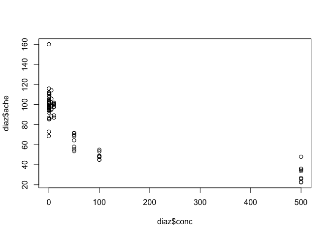
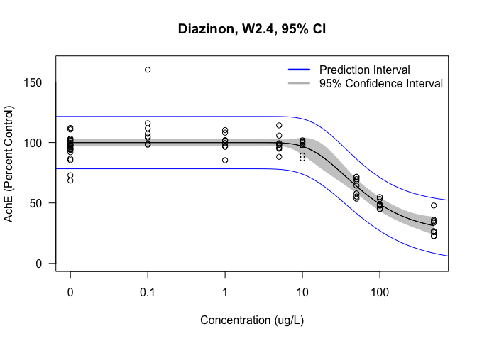
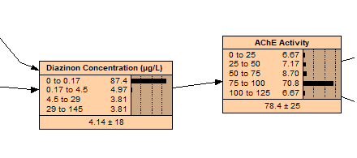
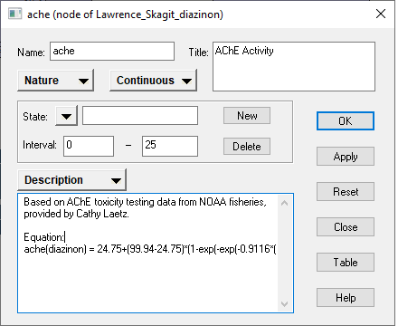
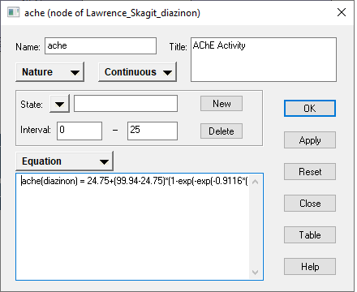
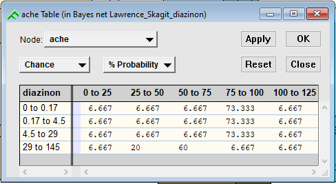

# Steps

1. Create dose-response model in R (drc package)
2. Extract coefficients from the drc model
3. Locate model equation in the drc documentation
4. Plug in coefficients from drc model
5. Change equation to Netica-compatible format
6. Copy equation into node properties
7. Run "equation to table" function in Netica to generate the conditional probability table (CPT)

# Step 1 - Create dose-response model

## Load in libraries and data

This data is from a NOAA Fisheries Study (Laetz et al. 2005) that tested diazinon toxicity to Coho salmon. They measured achetylcholinesterase inhibition along with mortality and changes in swimming speed for several concentrations of diazinon, other pesticides and mixtures of pesticides.


```r
library(drc)
library(dplyr)

diaz <- read.csv("Diazinon_R.csv") # Diazinon Data
```

## Diazinon Concentration-Response


```r
# Using only 2005 data
diaz <- diaz %>%
  filter(Year == "2005")

summary(diaz)
```

```
##    Exposure         Concentration           conc             ache       
##  Length:80          Length:80          Min.   :  0.00   Min.   : 22.42  
##  Class :character   Class :character   1st Qu.:  0.00   1st Qu.: 67.45  
##  Mode  :character   Mode  :character   Median :  3.00   Median : 96.22  
##                                        Mean   : 66.61   Mean   : 84.05  
##                                        3rd Qu.: 50.00   3rd Qu.:100.98  
##                                        Max.   :500.00   Max.   :160.14  
##    Control               Year     
##  Length:80          Min.   :2005  
##  Class :character   1st Qu.:2005  
##  Mode  :character   Median :2005  
##                     Mean   :2005  
##                     3rd Qu.:2005  
##                     Max.   :2005
```

```r
# Plot data for visual inspection

plot(diaz$ache~diaz$conc)
```

<!-- -->


## Dose-Response Model

The drm function is the dose-response model fitting function as part of the drc package. The fct parameter selects which dose-response model to use. These models are built into the drc package. See the attached pdfs for the drc package documentation that goes into detail about the different models and their equations. LL.3 is the log-logistic 3 parameter model and W2.4 is the Weibull type 2, 4 parameter model.

The mselect function takes a drm object as input and recreates the drm object using a list of models to provide best fit criteria. The reason the drm function is first in the code is because there needs to be a drm model in order to use the mselect function. When I first create a drm object I use the LL.3 (Log-logistic 3 parameter) model. I then use the mselect to see if I should use a different model instead based on the lowest residual variance. I then go back and change the fct parameter on the drm function and rerun the code if needed.


```r
############################## Model Construction

diaz.mod <- drm(diaz$ache~diaz$conc, fct=W2.4())

############################## Model Selection

mselect(diaz.mod, list(LL.3(), LL.4(), LL.5(), EXD.2(), EXD.3(), W1.3(), W1.4(), W2.3(), W2.4()) )
```

```
##          logLik       IC  Lack of fit  Res var
## W2.4  -301.5640 613.1281 3.349221e-03 115.8756
## W2.4  -301.5640 613.1281 3.349221e-03 115.8756
## LL.4  -301.7924 613.5849 2.783246e-03 116.5391
## EXD.3 -303.0637 614.1274 2.257589e-03 118.7401
## W1.4  -302.4774 614.9548 1.592663e-03 118.5520
## LL.5  -301.5563 615.1127 1.339363e-03 117.3980
## W2.3  -303.5703 615.1407 1.514657e-03 120.2536
## LL.3  -307.9265 623.8529 4.459004e-05 134.0892
## W1.3  -312.2308 632.4615 1.226216e-06 149.3232
## EXD.2 -324.2448 654.4897 1.239631e-10 199.0511
```

```r
#### W2.4 selected for best fit
```

## Prediction Intervals

The drc package does not automatically include prediction intervals in figures like it does for confidence intervals when graphing so here I am use the predict function (from drc) to create predictions along the drm model.

pre.seq is a sequence of x values to create predictions from.

pre.d is the dataframe that I am putting the prediction data into.

pre.p are the predictions calculated from the predict function using the pre.d dataframe that contains pre.d$conc which are the x values from pre.seq.

    # Add predictions to dataframe
    pre.d$p <- pre.p[,1]
    pre.d$p.l <- pre.p[,2]
    pre.d$p.u <- pre.p[,3]


This code is individually taking the columns out of the pre.p predictions object and putting them into the pre.d dataframe. p.l are the lower predictions and p.u are the upper predictions. The bracket notation is used in R to select data from a dataframe: [row, column]

pre.p[1,1] is the same as saying: select the data from the first row and first column. This is a single value.
pre.p[2,3] is select the data from the second row and third column.
pre.p[,3] by not putting a number for the row, you are selecting the entire column. This is saying select the entire 3rd column. The output of this code is a vector containing all the values in the third column of this dataframe. Don't forget the comma when you use this.


```r
################### Sequence of doses to predict

# Create a sequence of x values to make predictions from
pre.seq <- exp(seq(log(0.00001), log(1000), length = 100))

# Create a data frame with x values
pre.d <- expand.grid(conc = pre.seq)

# Make predictions
pre.p <- predict(diaz.mod, newdata = pre.d, interval = "prediction")

# Add predictions to dataframe
pre.d$p <- pre.p[,1]
pre.d$p.l <- pre.p[,2]
pre.d$p.u <- pre.p[,3]

# Make models for upper and lower predictions

pre.l.m <- drm(pre.d$p.l~pre.d$conc, fct = W2.4())
pre.u.m <- drm(pre.d$p.u ~ pre.d$conc, fct = W2.4())
```

## Concentration-Response Figure


```r
############################## Figure for Diazinon

plot(diaz.mod, type = "confidence", ylab = "AchE (Percent Control)",
     xlab = "Concentration (ug/L)",
     ylim = c(0,165),
     main = "Diazinon, W2.4, 95% CI")
plot(diaz.mod, type = "all", add = TRUE)

#Prediction Interval

plot(pre.l.m, add = TRUE, type = "none", col = "blue")
plot(pre.u.m, add=TRUE, type = "none", col = "blue")

#Legend

legend("topright", c("Prediction Interval", "95% Confidence Interval"),
       lty=c(1,1),
       lwd=c(2.5,2.5), 
       col=c('blue', 'gray'),
       bty = "n")
```

<!-- -->

# Step 2 - Extract coefficients from the drc model

Calling the model object itself will give you coefficients estimated by the model fitting function. You can also use summary() to get more details.


```r
############################## Model Parameters

diaz.mod
```

```
## 
## A 'drc' model.
## 
## Call:
## drm(formula = diaz$ache ~ diaz$conc, fct = W2.4())
## 
## Coefficients:
## b:(Intercept)  c:(Intercept)  d:(Intercept)  e:(Intercept)  
##       -0.9116        24.7515        99.9396        35.6787
```

```r
summary(diaz.mod)
```

```
## 
## Model fitted: Weibull (type 2) (4 parms)
## 
## Parameter estimates:
## 
##               Estimate Std. Error t-value   p-value    
## b:(Intercept) -0.91160    0.27274 -3.3423  0.001291 ** 
## c:(Intercept) 24.75148    7.83318  3.1598  0.002267 ** 
## d:(Intercept) 99.93955    1.58577 63.0226 < 2.2e-16 ***
## e:(Intercept) 35.67869    6.67792  5.3428 9.238e-07 ***
## ---
## Signif. codes:  0 '***' 0.001 '**' 0.01 '*' 0.05 '.' 0.1 ' ' 1
## 
## Residual standard error:
## 
##  10.76455 (76 degrees of freedom)
```

# Step 3 - Locate model equation

You can find the model equations in the drc package documentation:

https://cran.r-project.org/web/packages/drc/drc.pdf

The Weibull Type 2 - 4 parameter equation is located on p.142:

f(x) = c+(d-c)(1-exp(-exp(b(log(x)-log(e)))))

# Step 4 - Plug in coefficients

From model parameters above (Step 2)

f(x) = 24.75+(99.94-24.75)(1-exp(-exp(-0.9116(log(x)-log(35.68)))))

# Step 5 - Change equation to Netica format

Netica requires a specific equation syntax:

https://www.norsys.com/WebHelp/NETICA/X_Equation_Syntax.htm

In this case acetylcholinesterase inhibition (ache) is the node that we are intending to build a CPT for and it has one parent node, diazinon concentration (diazinon)



Changes:

* Replace f(x) with ache(diazinon)
* Replace x with diazinon
* I also had to add two asterisks (*) to get this equation to work. This is because if you have something other than a function or mathematical symbol before an open parenthesis, the software will see that as trying to use a function. For example with -0.9116(Log(diazinon)), it can't find the -0.9116 function.

ache(diazinon) = 24.75+(99.94-24.75)\*(1-exp(-exp(-0.9116*(log(diazinon)-log(35.68)))))


# Step 6 - Copy into Netica

Open the properties window for the node that you are building a CPT for, ache in this case.



The properties node has the description window open by default. Note that I copied the equation into the description too but for the equation to work you need to open the equation window from the dropdown menu that says description.



Copy the equation here.

# Step 7 - Generate CPT

The next step is to use the "equation to table" function to generate the CPT. Close the properties window. Select the node. At the top, click Table -> Equation to table.

A dialog box comes up to specify the number of samples per cell. Use the default of 10.

Next it will ask if you want to include uncertainty due to the sampling process. Click yes.



In this method it takes 10 random samples along the curve from each cell (or combination of discrete states) to generate the CPT. Note that because this method uses random sampling, you may get a different CPT each time you run this function. And I have found that Netica will try to ask you to run it again if there is a lot of variability. So what I have done is run it once to generate the CPT, then I will delete the equation from the equation window so that the CPT will not be altered. This is another important reason to have a copy of the equation in the description window in the properties.


